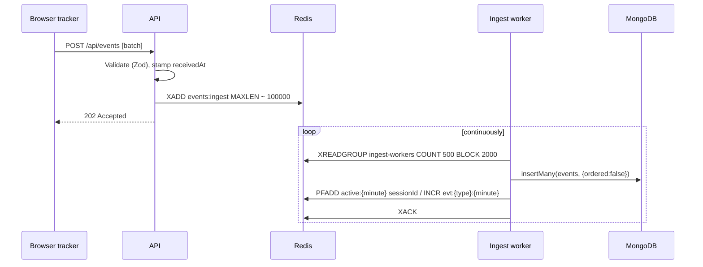
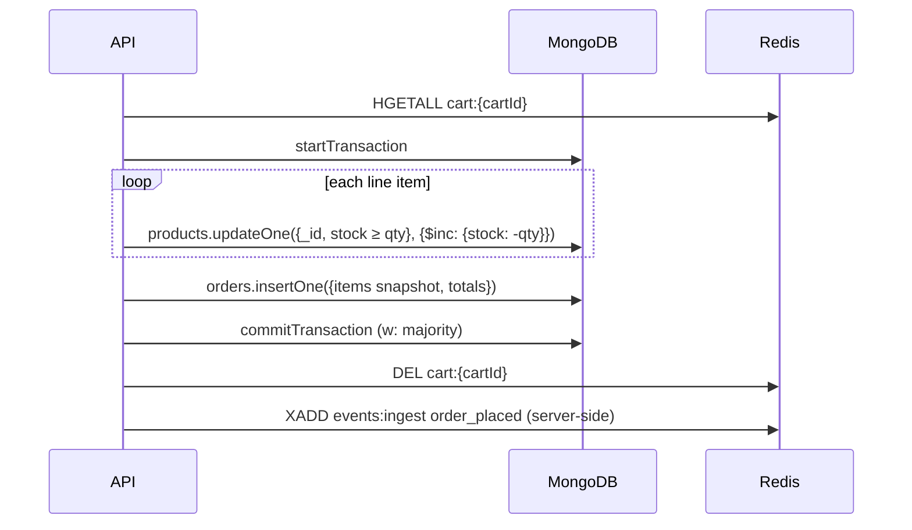

# Architecture

**Project:** Phone & electronic accessories e-commerce store with a NoSQL-backed customer telemetry platform.

This document describes the system architecture, the technology choices and why each one was made. Use cases (UC1–UC15) refer to [use-cases-and-roles.md](use-cases-and-roles.md).

---

## 1. Goals

1. Run a working storefront whose customer activity generates realistic telemetry.
2. Ingest that telemetry at high write volume without slowing the storefront.
3. Serve three staff roles (Analyst, Support, Admin) with dashboards that load fast.
4. Show, and justify, the characteristics, strengths and limitations of the NoSQL technologies used.

---

## 2. Technology stack

| Layer | Choice | Notes |
|---|---|---|
| Language | **TypeScript** (frontend and backend) | Shared event and DTO types between client and server |
| Frontend | **React + Vite**, React Router, TanStack Query, Recharts | One app: storefront plus role-gated `/staff/*` routes |
| Backend API | **Node.js 22 + Express** | REST API; request validation with **Zod** (schemas shared with frontend) |
| Primary database | **MongoDB 7** (3-node replica set) | Mongoose for catalog/users/orders; native driver for time-series and aggregations |
| Secondary store | **Redis 7** | Streams, counters, cache, carts, sessions |
| Background work | **Node worker process** | Stream consumer + scheduled rollups (`node-cron`) |
| Local infrastructure | **Docker Compose** | MongoDB replica set and Redis |
| Repo layout | **npm workspaces** monorepo | See §12 |

---

## 3. Data store selection & justification

> **Rule applied:** a store is included only if removing it would break a use case or make it meaningfully worse.

### 3.1 MongoDB: document store (primary)

| Need | MongoDB feature | Use cases |
|---|---|---|
| Heterogeneous product attributes (phone vs case vs charger) | Flexible schema; Mongoose discriminators on a single `products` collection | UC8, UC9 |
| Orders with a price snapshot of their line items | Embedded sub-documents | UC11, UC13 |
| Atomic stock decrement + order creation | Multi-document ACID transactions (requires replica set) | UC11 |
| Append-heavy event data queried by time range | **Time-series collection** (`events`) | UC1, UC12 |
| Funnels and reports | Aggregation pipeline (`$match`, `$group`, `$setWindowFields`) | UC2, UC3 |
| Pre-computed dashboards | `$merge` into rollup collections | UC6 |
| Automatic data expiry | `expireAfterSeconds` on time-series collection, changed with `collMod` | UC5 |
| High availability, health visibility | Replica set, `replSetGetStatus`, `serverStatus` | UC7 |
| Offloading analytics reads | `readPreference: secondaryPreferred` for analyst queries | UC1–UC3 |

### 3.2 Redis: key-value store (supporting)

| Need | Redis feature | Use case it serves | Why MongoDB alone is worse |
|---|---|---|---|
| Decouple event ingestion from the request path | **Streams** + consumer groups | UC8–UC11 | Synchronous DB writes on every click add latency and couple storefront availability to DB write load |
| "Active users now", live event rate | **HyperLogLog**, `INCR` counters with TTL | UC1 | Would need a count over raw events on every dashboard refresh |
| Instant dashboard loads | Result cache with TTL | UC6 | Funnel aggregations are expensive to recompute per page view |
| Cart state | Hash per cart with 30-day TTL | UC10 | Carts change on nearly every request, are temporary and are only looked up by key |
| Staff/customer sessions with instant revocation | Session keys + per-user session set | UC4 | JWTs cannot be revoked before expiry without a server-side store anyway |

### 3.3 Considered and rejected

| Technology | Family | Where it would fit | Why rejected |
|---|---|---|---|
| **Cassandra** | Wide-column | Append-only telemetry; partition-per-session lookups (UC12) | No aggregation; funnels (UC2) would need Spark or similar. Its write-scaling advantage only matters at a scale far beyond this project. |
| **Neo4j** | Graph | Accessory compatibility, "frequently bought together" | No use case requires multi-hop traversal; compatibility is an array of model IDs in MongoDB. Adding it would mean inventing a use case to fit the database. |
| **Elasticsearch** | Search engine / document | Product search (UC9) | MongoDB text indexes are enough for a catalog of this size. |

---

## 4. System overview

```mermaid
flowchart LR
    subgraph Browser[React app - Vite]
        SF[Storefront]
        ST[Staff dashboard<br/>Analyst / Support / Admin]
        TR[Telemetry tracker<br/>batches + sendBeacon]
    end

    SF -- REST --> API
    ST -- REST --> API
    TR -- POST /api/events --> API

    API[Node API<br/>Express]

    subgraph Redis[(Redis)]
        RS[Stream<br/>events:ingest]
        RC[Counters / HLL]
        RK[Cache]
        RCA[Carts]
        RSE[Sessions]
    end

    subgraph Mongo[(MongoDB replica set)]
        MP[(Primary)]
        MS1[(Secondary)]
        MS2[(Secondary)]
    end

    API -- XADD --> RS
    API -- carts / sessions / cache --> RCA & RSE & RK
    API -- reads counters --> RC
    API -- writes, transactions --> MP
    API -- analyst reads --> MS1

    W[Ingest worker] -- XREADGROUP / XACK --> RS
    W -- insertMany --> MP
    W -- PFADD / INCR --> RC
    RU[Rollup job<br/>every 5 min] -- aggregate + $merge --> MP

    SIM[Traffic simulator] -- POST /api/events<br/>+ storefront API --> API

    MP -. replication .-> MS1 & MS2
```

---

## 5. Components

| Component | Responsibility |
|---|---|
| **Storefront** (React) | Browse, search, cart, checkout. Embeds the telemetry tracker. |
| **Telemetry tracker** (React module) | Buffers client events, flushes every few seconds or at 20 events, and on page hide via `navigator.sendBeacon`. Attaches `anonymousId`, `sessionId`, `customerId` (if logged in). |
| **Staff dashboard** (React) | Role-gated routes: `/staff/analytics` (Analyst), `/staff/support` (Support), `/staff/admin` (Admin). |
| **API** (Node/Express) | Auth, catalog, cart, checkout, staff queries. Validates events with Zod and appends to the Redis Stream. Emits **server-side** events for trusted actions (`order_placed`, `checkout_failed`). |
| **Ingest worker** (Node) | Consumes the stream in a consumer group, bulk-inserts into `events`, updates real-time counters, acknowledges entries. |
| **Rollup job** (in worker, `node-cron`) | Aggregates recent events into `metrics_hourly` and `funnel_daily` via `$merge`. |
| **Traffic simulator** (Node script) | Generates thousands of synthetic shopper sessions with configurable drop-off probabilities per funnel step, so dashboards have realistic data for the demo. |

---

## 6. Key data flows

### 6.1 Telemetry ingestion (UC8–UC11 → UC1)



- **Delivery guarantee: at least once.** If the worker crashes after `insertMany` but before `XACK`, the batch is redelivered (recovered with `XAUTOCLAIM`) and may be inserted twice. Time-series collections do not support unique indexes, so exact deduplication is not enforced by the database. A small duplicate rate is accepted for analytics. This is a *limitation* to discuss in the report.
- **Write concern for events: `w:1`** (fast, small risk of loss on primary failover). Orders use `w:"majority"`. Choosing consistency per operation like this is a NoSQL *characteristic*.

### 6.2 Checkout (UC11)



If any stock update matches zero documents, the transaction aborts and a `checkout_failed` event is emitted with the reason. The Support Agent sees this in UC12.

### 6.3 Dashboard read path (UC1–UC3, UC6)

1. API computes a cache key from the query parameters: `cache:funnel:{hash}`.
2. **Hit:** return the cached JSON.
3. **Miss:** query the rollup collections (`funnel_daily`, `metrics_hourly`) on a secondary, falling back to raw `events` only for the current incomplete period. Cache for 60 s.
4. "Live" widgets read Redis counters directly: `PFCOUNT active:{m-4}..active:{m}` gives unique sessions in the last 5 minutes.

---

## 7. MongoDB layout (high level)

Full schemas, event catalogue and index rationale: [data-model.md](data-model.md).

| Collection | Type | Purpose | Key indexes |
|---|---|---|---|
| `products` | Regular, polymorphic (discriminator `kind`: `phone`, `case`, `charger`, `audio`, …) | Catalog | `{kind:1, brand:1}`, text index on name/description, `{compatibleModels:1}` |
| `users` | Regular | Customers and staff (`role` field) | `{email:1}` unique |
| `orders` | Regular | Orders with embedded line-item snapshot | `{customerId:1, createdAt:-1}` |
| `events` | **Time-series**: `timeField: ts`, `metaField: meta {customerId, anonymousId, sessionId}`, `granularity: seconds`, `expireAfterSeconds` configurable | Raw telemetry | `{"meta.sessionId":1, ts:1}`, `{"meta.customerId":1, ts:-1}`, `{"meta.anonymousId":1}`, `{type:1, ts:1}` |
| `session_summaries` | Regular (rollup) | One document per session for Support lists | `{customerId:1, startedAt:-1}`, `{anonymousId:1, startedAt:-1}` |
| `metrics_hourly` | Regular (rollup) | Event counts per type per hour | `{hour:1, type:1}` unique |
| `funnel_daily` | Regular (rollup) | Step counts per funnel per day | `{day:1, funnel:1}` unique |
| `session_notes` | Regular | Support annotations/flags on sessions | `{sessionId:1}`, `{flagged:1, createdAt:-1}` |
| `settings` | Regular | Admin-configurable values (retention days, etc.) | — |
| `audit_log` | Regular | Staff actions (access changes, erasures) | `{at:-1}` |

**Time-series `metaField` trade-off.** `customerId`/`sessionId` are placed in `meta` so that:
- per-session timelines (UC12) are grouped into the same buckets and are cheap to read, and
- Right-to-erasure requests (UC15) can `deleteMany` by `meta.customerId`. Time-series deletes were limited to `metaField` filters before MongoDB 7.0.

The cost: high-cardinality meta values produce many small buckets and weaker compression. This is documented as a deliberate trade-off.

---

## 8. Redis key layout

| Key pattern | Type | TTL | Purpose |
|---|---|---|---|
| `events:ingest` | Stream (group `ingest-workers`) | trimmed `MAXLEN ~ 100000` | Ingestion buffer |
| `active:{yyyyMMddHHmm}` | HyperLogLog | 2 h | Unique sessions per minute |
| `evt:{type}:{yyyyMMddHHmm}` | String counter | 2 h | Events per type per minute |
| `cache:{query}:{hash}` | String (JSON) | 60 s | Dashboard query cache |
| `cart:{cartId}` | Hash (`productId → qty`) | 30 d, refreshed on write | Cart contents |
| `sess:{sessionId}` | Hash (`userId`, `role`, `createdAt`) | 7 d customer / 8 h staff | Login session |
| `user_sessions:{userId}` | Set of session IDs | — | Revoke all of a user's sessions (UC4) |

**Persistence:** AOF with `appendfsync everysec`, so a crash can lose up to about 1 s of cart updates and un-ingested stream entries. This is acceptable for carts and analytics, and it's the reason orders are **never** stored only in Redis.

---

## 9. Access control (UC4)

| Role | Access |
|---|---|
| `customer` | Storefront, own cart and orders |
| `analyst` | `/staff/live`, `/staff/funnel`, `/staff/trends`: aggregated data only, **read-only**, no PII |
| `support` | `/staff/support/*`: customer search, session timelines, failed-checkout and escalation queues, order and cart history, with **masked PII** (e.g. `j***@gmail.com`); can add and resolve session notes |
| `admin` | `/staff/admin/*` plus everything above: user/role management, retention, indexes and rollups, health, erasure, audit log |

- Enforced in API middleware from the Redis session (`role`); the dashboard sidebar only hides links. Because the role is cached in the session, **changing a user's role or disabling them revokes their sessions** so the change applies on the next request.
- Staff pages don't emit storefront telemetry, so staff browsing can't skew customer analytics.
- PII masking is applied in the API response layer for `support`.
- **Database-level RBAC** backs up the application RBAC. MongoDB runs with authentication, and the members authenticate to each other with a keyfile:
  - `da2_app`: `readWrite` + `dbAdmin` on `da2` (for TTL `collMod` and indexes), plus `clusterMonitor` (for the UC7 health page)
  - `da2_analyst`: `read` on `da2` only; every Analyst query runs on this connection with `secondaryPreferred`, so even a bug in the API cannot make an analyst request write data
  - `root`: operations only, never used by the app
- Staff actions are written to `audit_log`.

---

## 10. Admin operations mapping

| Use case | Implementation |
|---|---|
| UC5 Configure Data Purging | Admin sets retention days → saved in `settings` → API runs `collMod: "events", expireAfterSeconds: N` |
| UC6 Manage Indexes & Pre-Aggregated Views | List indexes with size (`$collStats`) and `$indexStats` usage (zero-use indexes highlighted); last rollup run from `settings`; "rebuild" sets `rollups:rebuild` in Redis, which the worker picks up within 15 s. (`explain()` output lives in the evidence folder rather than an in-app viewer.) |
| UC7 Monitor System Health | `replSetGetStatus` (member states, replication lag), `serverStatus` (connections, opcounters, transactions), `dbStats` (data vs compressed storage), Redis `INFO`, stream backlog via `XINFO GROUPS` (pending + lag) and the dead-letter stream length |
| UC15 Erase Customer Data (right to erasure, Sri Lanka PDPA; see [use cases §2.4](use-cases-and-roles.md#24-legal-context-sri-lankas-pdpa-not-gdpr)) | Admin types the customer's email to confirm. `events.deleteMany` by `meta.customerId` **and** the linked `meta.anonymousId`s (so pre-signup browsing goes too), delete their `session_summaries` and `session_notes`, pseudonymise `orders` (kept for financial records: name, email, phone, street, postcode removed; items, totals and city kept), revoke Redis sessions and delete the cart, pseudonymise the `users` document **last**, write `audit_log` (counts only, no PII). No transaction: time-series writes can't run inside one and Redis isn't covered anyway, so every step is **idempotent** and the erasure can simply be re-run. Known gaps: events still in the Redis stream (until `MAXLEN` trims them), the oplog, and backups. The live `active:{minute}` HyperLogLogs can't have a member removed, but they hold only hashed register values (no retrievable IDs) and expire after 2 hours. |

---

## 11. Deployment (local)

Docker Compose runs the infrastructure. The Node processes run on the host during development (`npm run dev`) for fast reload.

| Service | Image | Notes |
|---|---|---|
| `mongo1`, `mongo2`, `mongo3` | `mongo:7.0` | Replica set `rs0` with keyfile authentication, members advertised as `host.docker.internal:27017-27019`; `mongo1`'s healthcheck initiates the set and creates the users on first start |
| `redis` | `redis:7.4` | AOF enabled |

**Viva demo:** stop the primary (`docker stop mongo1`). The admin health page (UC7) shows a new primary being elected while the storefront keeps working.

**Scaling (theoretical, for the report):** at larger scale `events` would be sharded on `{ "meta.customerId": "hashed" }` to spread writes evenly, at the cost of time-range queries hitting every shard. Redis would move to Redis Cluster, and more ingest workers would be added to the same consumer group.

---

## 12. Repository structure

```
DA2/
├── docs/                    # Documentation (this file, use cases, data model, report drafts)
├── apps/
│   ├── web/                 # React + Vite (storefront + staff dashboard)
│   ├── api/                 # Express API
│   └── worker/              # Stream consumer + rollup jobs
├── packages/
│   └── shared/              # Zod schemas, event types, shared constants
├── scripts/
│   ├── seed-catalog.ts      # Seed phones & accessories
│   └── simulate-traffic.ts  # Synthetic shopper sessions
├── infra/
│   └── docker-compose.yml   # MongoDB replica set + Redis
└── package.json             # npm workspaces root
```

---

## 13. Open items

- [x] Install Docker Desktop (WSL 2 backend)
- [x] Data model document: full schemas, event catalogue, index rationale ([data-model.md](data-model.md))
- [x] Decide catalog size / seed data source (~60–100 curated real products, seed script)
- [ ] Scaffold monorepo
