<!--
DRAFT NOTES (delete this block before exporting to PDF)
- Evidence placement: screenshots are embedded directly (relative paths into /evidence). Text evidence
  is summarised in tables in the body and cited as "📎 Evidence: <file>"; Appendix C maps every
  evidence file to its section. If you paste into Word instead, insert each image where it appears here.
- Placeholders to fill in: [Student name], [Student ID], [Module code / name], [Lecturer], [Word count].
- References: check each one against your university's Harvard guide (page numbers, access dates).
- Everything claimed here is covered in docs/study-guide.md; read the matching phase section before the viva.
-->

# Cellora: A NoSQL Telemetry Platform for a Phone and Accessories Store

**[Module code / name]** · **[Student name]** ([Student ID]) · Lecturer: [Lecturer] · Submitted: 2 October 2026

---

## Abstract

This report presents *Cellora*, a working e-commerce store for phones and accessories in Sri Lanka, with a behavioural telemetry platform built on two NoSQL databases: MongoDB, a document store, and Redis, a key-value store. The storefront records every customer interaction as an event. The events flow through a Redis Stream into a MongoDB time-series collection and are pre-aggregated into materialised views that power dashboards for three staff roles: a read-only growth analyst, a customer support agent and an administrator. The application is used to demonstrate, with measured evidence, the characteristics, applications, strengths and limitations of NoSQL systems:

- **Flexible schemas:** seven product kinds in one collection.
- **Query-driven modelling:** every index plan uses an index scan.
- **Atomic and transactional updates:** 20 simultaneous buyers of the last unit resulted in exactly one sale.
- **Decoupled high-throughput ingestion:** about 30,000 events/s accepted by the API.
- **Pre-aggregation:** a 14-day funnel in 2.2 ms instead of 144 ms.
- **Replica set failover:** the primary killed under load, with no failed requests and no lost events.

It also documents where NoSQL is weaker: no referential integrity, the cost and risk of denormalisation (made concrete by a right-to-erasure request under Sri Lanka's Personal Data Protection Act), at-least-once duplicates, eventual consistency and the loss of write availability without a majority. The evaluation compares the design with an equivalent relational one and discusses how it would scale.

---

## Contents

1. Introduction
2. NoSQL background
3. Requirements
4. Solution design
5. Data model
6. Implementation
7. Characteristics of NoSQL demonstrated
8. Applications of NoSQL
9. Strengths
10. Limitations
11. Evaluation
12. Conclusion and future work
References
Appendix A: Running the application
Appendix B: API reference
Appendix C: Evidence index

---

## 1. Introduction

### 1.1 Business context

Cellora is a fictional online retailer selling smartphones and accessories (cases, screen protectors, chargers, audio, power banks and smartwatches) to customers in Sri Lanka, with prices in Sri Lankan rupees (LKR). Like most online shops, it loses most visitors before they buy. In the simulated dataset used here, 4.7% of sessions end in an order. The business wants to know **where** customers abandon the journey and **why**. It also wants support staff to see exactly what a complaining customer did, and administrators to keep the platform fast, healthy and compliant with data-protection law.

### 1.2 Problem

Answering those questions needs fine-grained behavioural data: every page view, search, add-to-cart and checkout attempt. That data has properties that suit relational databases poorly and NoSQL databases well:

- It is **write-heavy and append-only**: many small events per visitor, never updated.
- It is **heterogeneous**: each event type carries different fields.
- It is **time-ordered and expiring**: recent data is queried most, and old data should be deleted automatically.
- It is **read in two very different ways**: wide aggregations across all users (funnels, trends) and narrow lookups of one session (support).

At the same time, the shop itself has a product catalogue whose items have very different attributes, and orders whose stock and payment must be **strongly** consistent.

### 1.3 Objectives

1. Build a working storefront and telemetry platform covering all approved use cases (UC1–UC15, §3).
2. Choose NoSQL technologies by use case and justify each choice. Include a second technology only where MongoDB alone would be worse.
3. Model the data around its access patterns and document every embed, reference and denormalisation decision.
4. Demonstrate NoSQL characteristics in the running application, and back every claimed strength and limitation with reproducible evidence.
5. Evaluate the design against a relational alternative and against larger scale.

### 1.4 Scope and deliverables

- **In scope:** catalogue, search, cart, checkout (with simulated payment, no card data), customer accounts, telemetry capture and ingestion, rollups, analyst, support and admin dashboards, retention, erasure, monitoring, a traffic simulator and automated evidence capture.
- **Out of scope:** real payments, delivery, product images and production hosting.
- **Deliverables:** the source code (TypeScript monorepo), this report, and an evidence folder of 76 captures (command output and screenshots) regenerated by scripts (`npm run evidence -- <set>`, Appendix C).

### 1.5 Report structure

- Section 2 introduces NoSQL.
- Sections 3–6 cover requirements, design, data model and implementation.
- Sections 7–10 address the assessment themes directly: characteristics, applications, strengths and limitations. Each is linked to the application and its evidence.
- Section 11 evaluates the work, and Section 12 concludes.

---

## 2. NoSQL background

### 2.1 Definition and origins

"NoSQL" is an umbrella term for databases that do not use the relational model of tables, rows and joins described by Codd (1970) as their primary way of storing data. It is usually read as "not only SQL". The name was used in 1998 by Carlo Strozzi for a lightweight relational database without an SQL interface. It gained its current meaning in 2009, when Johan Oskarsson used it as the title of a meetup about open-source distributed, non-relational databases (Sadalage and Fowler, 2012).

The movement grew out of the needs of large web companies in the 2000s:

- Google's Bigtable (Chang *et al.*, 2006) and Amazon's Dynamo (DeCandia *et al.*, 2007) showed that giving up some relational guarantees (joins, multi-row transactions, a fixed schema) allowed data to be spread across many cheap machines with very high availability and throughput.
- Open-source systems followed: Cassandra (Lakshman and Malik, 2010), MongoDB, Redis, HBase, CouchDB, Neo4j and others (Cattell, 2011).

### 2.2 Why NoSQL emerged

Sadalage and Fowler (2012) identify two main drivers:

1. **Scale.** Relational databases were designed to run on one large server (scale *up*). Web-scale data and traffic are cheaper to handle across clusters of commodity servers (scale *out*). Joins and multi-row transactions are hard to distribute efficiently.
2. **The impedance mismatch.** Applications work with rich, nested objects (an order with its lines and address). Relational storage forces these to be split across several tables and reassembled with joins. Many NoSQL stores keep such an *aggregate* together as a single unit.

### 2.3 NoSQL families

| Family | Data model | Typical systems | Good at | Used in Cellora? |
|---|---|---|---|---|
| **Document** | JSON-like documents with nested fields and arrays, grouped in collections | MongoDB, Couchbase, Firestore | Aggregates with varying structure; rich queries and indexes on any field | **Yes: MongoDB** (catalogue, orders, users, events, rollups) |
| **Key-value** | Opaque values looked up by a key; some stores add data structures | Redis, Amazon DynamoDB, Riak | Extremely fast lookups, caching, sessions, counters, queues | **Yes: Redis** (sessions, carts, cache, counters, event stream) |
| **Wide-column** | Rows with dynamic columns grouped into column families, partitioned by key | Cassandra, HBase, Bigtable | Massive write throughput, time-ordered data per partition | Considered, rejected (§4.3) |
| **Graph** | Nodes and relationships with properties | Neo4j, Amazon Neptune | Multi-hop relationship queries (social networks, fraud rings, recommendations) | Considered, rejected (§4.3) |

Many modern systems mix families. MongoDB adds time-series collections and multi-document transactions. Redis adds streams and probabilistic structures. Search engines such as Elasticsearch are document stores specialised for full-text search.

### 2.4 ACID and BASE

Relational databases traditionally provide **ACID** transactions (Härder and Reuter, 1983):

- **Atomicity:** all or nothing.
- **Consistency:** constraints hold before and after.
- **Isolation:** concurrent transactions don't see each other's partial work.
- **Durability:** committed data survives crashes.

Many NoSQL systems instead offer **BASE** (Pritchett, 2008): *Basically Available, Soft state, Eventually consistent*. The system stays responsive and replicas are allowed to disagree briefly, converging over time. The choice is not all-or-nothing. MongoDB is ACID for single-document operations and, since version 4.0, for multi-document transactions on a replica set. Cellora deliberately uses **both** models: ACID for money and stock (§6.3), BASE for analytics (§7.5).

### 2.5 The CAP theorem and PACELC

Brewer (2000) conjectured, and Gilbert and Lynch (2002) proved, that a distributed data store cannot simultaneously guarantee:

- **Consistency:** every read sees the latest write.
- **Availability:** every request to a working node gets a response.
- **Partition tolerance:** the system keeps working when the network splits it.

Because network partitions cannot be ruled out, the real choice is **what to sacrifice during a partition**: consistency (an *AP* system) or availability (a *CP* system). Brewer (2012) later stressed that this is a choice made per operation and per moment, not once for a whole system.

Abadi (2012) extends CAP as **PACELC**: *if* there is a Partition, trade Availability against Consistency; *Else*, trade Latency against Consistency. MongoDB with majority writes is PC/EC: it prefers consistency. Its read preferences (reading from secondaries) let an application choose lower latency and load at the cost of slightly stale data.

Cellora shows both sides with real failures in §9.4 and §10.5.

### 2.6 Schema-on-write and schema-on-read

- **Schema-on-write:** a relational database checks every row against a fixed table definition when it is written. Changing the structure needs a migration (`ALTER TABLE`).
- **Schema-on-read:** most NoSQL stores accept documents of any shape, and the application interprets them when reading.

This makes change cheap but moves responsibility for data quality to the application. MongoDB sits in between. It is schemaless by default, but can enforce a **JSON Schema validator** on a collection. Cellora uses exactly that hybrid (§7.1).

### 2.7 Scaling: replication and sharding

NoSQL systems scale out in two ways:

- **Replication:** copies of the same data on several nodes. This provides availability and read capacity.
- **Sharding:** different parts of the data on different nodes. This provides write capacity and storage.

MongoDB implements replication with **replica sets**: one primary accepts writes and secondaries copy its operation log (oplog), with automatic election of a new primary on failure (MongoDB, 2026b). Sharding splits collections by a **shard key**. Cellora runs a three-member replica set. Sharding is discussed as future work (§11.5).

---

## 3. Requirements

### 3.1 Actors

The lecturer-approved use case diagram (Figure 1) defined two actors, a read-only **Product Growth Analyst** and an **Admin**, with use cases UC1–UC7. It was extended, with approval, by:

- A **Customer** (the shopper whose actions generate the telemetry).
- A **Customer Support Agent**. This role adds a different access pattern: narrow point lookups on one customer, where the analyst runs wide aggregations.
- One more admin use case: **UC15 Erase Customer Data**.
- UC6 was renamed from "Optimize System Speed" to "Manage Indexes & Pre-Aggregated Views" to describe what the admin actually does.

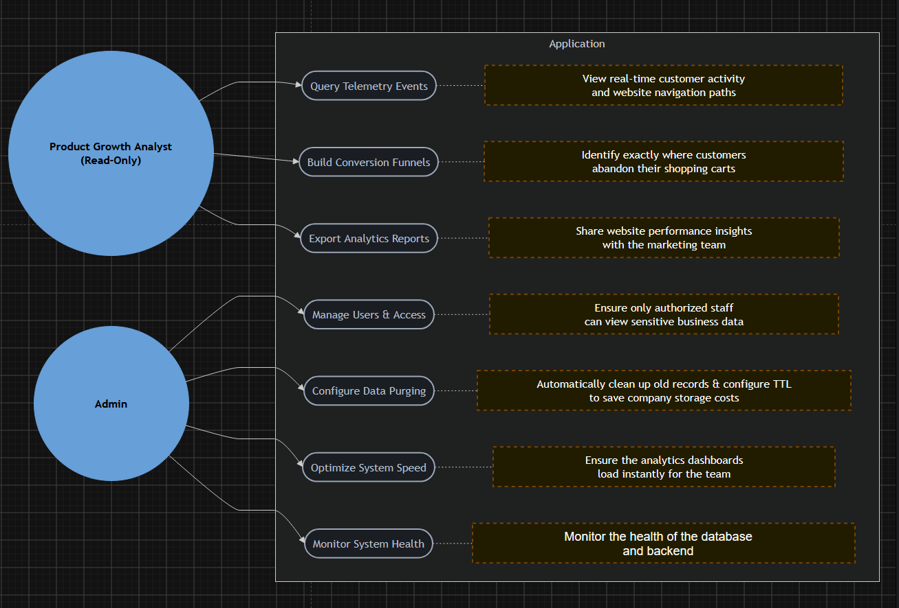

*Figure 1: The approved use case diagram (baseline).*

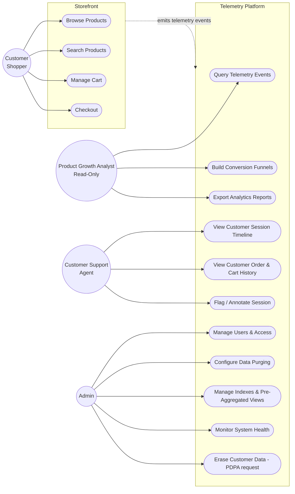

*Figure 2: The extended use case diagram (approved extensions).*

### 3.2 Use case descriptions

| # | Use case | Actor | Summary | NoSQL feature exercised |
|---|---|---|---|---|
| UC8 | Browse Products | Customer | Category listings with filters, product pages with variants and compatible accessories | Polymorphic documents, multikey and compound indexes, `$facet` |
| UC9 | Search Products | Customer | Weighted full-text search | Text index |
| UC10 | Manage Cart | Customer | Guest and logged-in carts, merged at login | Redis hashes with TTL |
| UC11 | Checkout | Customer | Place an order; stock can never be oversold | Atomic conditional update, multi-document ACID transaction |
| UC1 | Query Telemetry Events | Analyst | Live activity, hourly trends, top products and searches | Redis HyperLogLog and counters, time-series collection, rollups |
| UC2 | Build Conversion Funnels | Analyst | Ordered purchase funnel by day and device | Aggregation pipeline, `$merge` materialised view |
| UC3 | Export Analytics Reports | Analyst | Any report as CSV or JSON | Aggregation, cached results |
| UC12 | View Customer Session Timeline | Support | Find a customer; replay any session event by event | Point lookup by `metaField`, identity stitching |
| UC13 | View Order & Cart History | Support | Any order; the customer's live cart | Embedded order snapshot, Redis cart |
| UC14 | Flag / Annotate Session | Support | Notes and an escalation queue | Partial updates, compound index |
| UC4 | Manage Users & Access | Admin | Roles, disable, revoke sessions | Redis sessions (instant revocation), database-level users |
| UC5 | Configure Data Purging | Admin | Retention period for raw events | Time-series TTL changed with `collMod` |
| UC6 | Manage Indexes & Pre-Aggregated Views | Admin | Index sizes and usage; rebuild rollups | `$indexStats`, `$collStats`, `$merge` |
| UC7 | Monitor System Health | Admin | Replica set, server, Redis and pipeline health | `replSetGetStatus`, `serverStatus`, Redis `INFO`, `XINFO` |
| UC15 | Erase Customer Data | Admin | Right-to-erasure request | Deletes by time-series `metaField` across denormalised data |

### 3.3 Non-functional requirements

| Requirement | Target | Where it is shown |
|---|---|---|
| Correct stock under concurrency | No overselling, ever | §6.3, Table 3 |
| Telemetry must not slow the storefront | Event API independent of database latency | §6.4, §9.3 |
| Dashboards load "instantly" (UC6) | Tens of milliseconds, independent of history size | §9.5 |
| Availability | Survive the loss of one database node | §9.4 |
| Least privilege | Analysts read-only at the database level; support sees masked PII | §7.8 |
| Data lifecycle | Raw events expire automatically; a customer can be erased | §6.8, §10.2 |

### 3.4 Legal context: Sri Lanka's Personal Data Protection Act

UC15 was approved as a "GDPR request". Cellora sells only in Sri Lanka, however, and the EU's General Data Protection Regulation reaches non-EU businesses only when they offer goods or services to people in the EU or monitor their behaviour there (GDPR Art. 3(2)). The applicable law is therefore Sri Lanka's **Personal Data Protection Act, No. 9 of 2022** (PDPA). The PDPA is closely modelled on the GDPR, and its data subject rights include **erasure (s.16)**.

The PDPA is being brought into force in stages:

- In 2023, only the provisions creating the Data Protection Authority and administrative parts took effect.
- The PDPA (Amendment) Act No. 22 of 2025 removed the fixed commencement timelines.
- Gazette Extraordinary No. 2498/16 (22 July 2026) brings Part I (processing of personal data) and Part III (controllers and processors) into operation on **1 January 2027**.
- Part II (rights of data subjects, including erasure) and Part VII (penalties) have no commencement date yet (Data Protection Authority of Sri Lanka, 2026).

Cellora therefore implements erasure **ahead of commencement**, as privacy by design. If the shop sold to EU customers, the GDPR would apply as well, and the same mechanism would serve both.

---

## 4. Solution design

### 4.1 Architecture

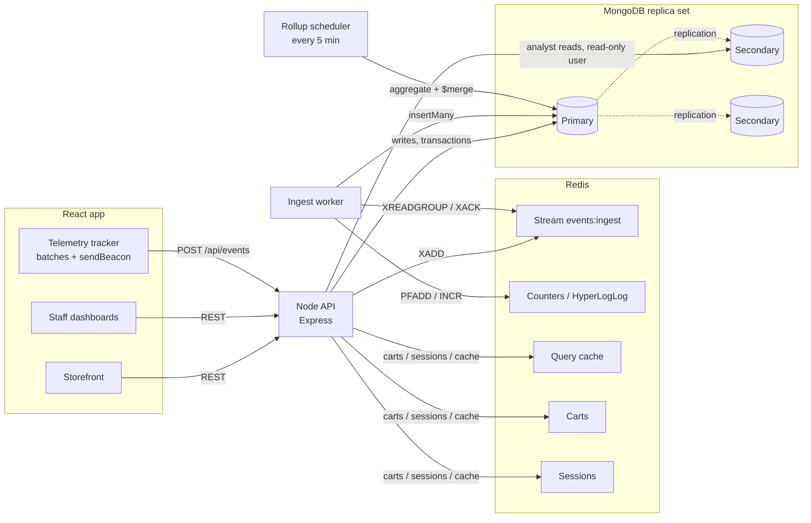

*Figure 3: System architecture.*

The system has four processes:

- **The React app:** the storefront, the staff dashboards and a telemetry tracker.
- **An Express API:** validates input with Zod schemas shared with the frontend, and enforces role-based access.
- **A worker:** consumes the event stream and maintains the rollups.
- **A traffic simulator** for realistic data.

MongoDB 7.0 runs as a **three-member replica set with keyfile authentication**, and Redis 7.4 runs with append-only-file persistence, all in Docker Compose. Everything is TypeScript in one npm-workspaces monorepo, so event and response types are shared by browser, API and worker.

📎 Evidence: `01-foundation/docker-compose-ps.md`, `01-foundation/replica-set-status.md`, `01-foundation/api-health.png`.

### 4.2 Technology selection and justification

The rule applied was that **a store is included only if removing it would break a use case or make it meaningfully worse.**

**MongoDB (document store), the system of record.**

| Need | MongoDB feature | Use cases |
|---|---|---|
| Products with very different attributes | Flexible documents; one polymorphic collection | UC8, UC9 |
| Orders that record what was bought, at what price | Embedded sub-documents (snapshots) | UC11, UC13 |
| Stock decrement and order creation that must never half-happen | Atomic updates and multi-document ACID transactions | UC11 |
| Append-heavy, time-ordered, expiring events | Time-series collection with TTL | UC1, UC5, UC12 |
| Funnels, trends and reports | Aggregation pipeline; `$merge` into materialised views | UC2, UC3, UC6 |
| Availability and read offloading | Replica set; secondary reads | UC1–UC3, UC7 |

**Redis (key-value store with data structures), included for five jobs MongoDB would do worse.**

| Need | Redis feature | Why MongoDB alone is worse |
|---|---|---|
| Decouple event ingestion from the request path | **Stream** with a consumer group | A database write on every click adds latency and couples storefront availability to the database (§9.3, §9.4) |
| "Active users right now", live event rate | **HyperLogLog**, counters with TTL | Would need a distinct count over raw events on every dashboard refresh |
| Instant dashboards | Result cache with TTL | Aggregations recomputed on every page view |
| Carts | Hash per cart, 30-day TTL | Carts change on almost every request, are temporary, and are only read by key |
| Sessions with instant revocation | Session hash plus a per-user set | A stateless token (JWT) can't be revoked before it expires |

### 4.3 Alternatives considered and rejected

| Technology | Family | Where it could fit | Why rejected |
|---|---|---|---|
| **Cassandra** | Wide-column | Append-only telemetry, partitions per session | No aggregation: funnels would need Spark or similar. Its write-scaling advantage matters only far beyond this project's volume |
| **Neo4j** | Graph | Accessory compatibility, "bought together" | No use case needs multi-hop traversal; compatibility is an array of model keys (§5.3). Adding it would mean inventing a use case to fit the database |
| **Elasticsearch** | Search / document | Product search | MongoDB text indexes suffice for 80 products; its limitations are discussed in §10.6 |

Choosing *two* NoSQL stores, each for what it does best, is itself an example of **polyglot persistence** (Sadalage and Fowler, 2012).

### 4.4 Key data flows

1. **Telemetry.**
   - The tracker buffers events in the browser and sends batches, using `sendBeacon` when the page is hidden.
   - The API validates each event, stamps the device and receive time, and appends it to the Redis Stream with `XADD`, then answers **202 Accepted**. It never touches MongoDB on this path.
   - The worker reads batches of up to 500 with `XREADGROUP`, inserts them with one unordered `insertMany`, updates the live counters, and only then acknowledges them (`XACK`).
2. **Checkout.** Prices and stock are read fresh from MongoDB. Inside one transaction, each line's stock is decremented conditionally and the order is inserted. Then an `order_placed` server event is emitted.
3. **Dashboards.**
   - The analyst's queries go through a separate **read-only** database user with `readPreference: secondaryPreferred`, behind a Redis read-through cache.
   - Support queries use the primary, because an agent must see a note straight after saving it (read-your-writes).

### 4.5 Security design

- **Defence in depth for access control:**
  - Application roles (customer, analyst, support, admin) are enforced on every API route.
  - Database users mirror them. `da2_app` can read and write. `da2_analyst` can **only read**, so even a bug in the analyst code cannot modify data.
- **Sessions** live in Redis and the browser holds only a random 256-bit id in an httpOnly cookie. Passwords are hashed with scrypt.
- **Data minimisation:** contact details are **masked in API responses** for the support role, and staff activity is excluded from customer telemetry.

📎 Evidence: `01-foundation/database-access-control.md`, `03-auth-cart/rbac-matrix.md`, `08-dashboards/rbac-dashboards.md`.

---

## 5. Data model

### 5.1 Principles

NoSQL data modelling starts from the **queries**, not from the entities (Sadalage and Fowler, 2012). Four rules were applied:

1. Embed what is read together and bounded.
2. Reference what is shared or unbounded.
3. Denormalise (copy) only where a read path needs it, and record how the copy stays correct.
4. Enforce the invariants that must never break in the database itself, not only in code.

### 5.2 Collections

| Collection | Type | Purpose | Main access patterns |
|---|---|---|---|
| `products` | Regular, **JSON Schema validator** | Polymorphic catalogue, 7 kinds, 80 products / 173 SKUs | By slug; by kind sorted by price; by brand; by compatible model; text search |
| `users` | Regular | Customers and staff | By email (login); by linked anonymous id |
| `orders` | Regular | Orders with embedded snapshots | By order number; by customer, newest first |
| `events` | **Time-series** (`timeField: ts`, `metaField: meta`), TTL 90 days | Raw telemetry | By session in time order; by type and time range; by customer |
| `session_summaries` | Materialised view | One document per session | By customer / anonymous id; failed checkouts |
| `metrics_hourly` | Materialised view | Events per Sri Lanka local hour and type | By hour range |
| `funnel_daily` | Materialised view | Ordered funnel per local day, per device | By day range |
| `session_notes` | Regular | Support annotations (UC14) | By session; escalation queue |
| `settings`, `audit_log` | Regular | Configuration; staff actions | Point read; newest first |

In Redis: `sess:{id}` hashes and `user_sessions:{userId}` sets (sessions), `cart:{id}` hashes (carts), the stream `events:ingest`, `active:{minute}` HyperLogLogs and `evt:{type}:{minute}` counters, and `cache:{name}:{hash}` strings.

📎 Evidence: `01-foundation/collections-and-indexes.md`.

### 5.3 A polymorphic catalogue

A phone has storage, RAM, a chipset and a camera. A case has a material and compatible models. A charger has a wattage and connectors. In a relational schema this means either one wide table full of NULLs, an entity-attribute-value table (which is hard to query and cannot enforce types), or one table per kind joined to a parent.

In MongoDB they share one `products` collection. Common fields (`kind`, `slug`, `name`, `brand`, `basePrice`, `variants`) sit at the top, and kind-specific fields are simply present or absent. The application defines each kind as a Mongoose **discriminator** (Figure 4 shows two very different documents side by side).

- **Variants** (storage and colour combinations, each with its own SKU, price and stock) are **embedded**. They are always read with the product, bounded in number, and embedding lets one atomic update touch a single variant's stock (§6.3).
- **Accessory compatibility** is an array of model keys (`compatibleModels: ["apple-iphone-16-pro", …]`) with a **multikey index**. Answering "which cases fit this phone?" is one indexed lookup, with no join table and no graph database.

```js
// kind: "phone"                                   // kind: "screen_protector"
{ kind: "phone", slug: "galaxy-s25-ultra",         { kind: "screen_protector",
  brand: "Samsung", basePrice: 42990000,             slug: "whitestone-dome-glass-galaxy-s25-ultra",
  variants: [{ sku: "GS25U-256-TS",                  brand: "Whitestone", basePrice: 1190000,
    attributes: { storageGb: 256,                    variants: [{ sku: "WSDG-GALAXYS25ULTRA",
                  color: "Titanium Silverblue" },      label: "1-pack", price: 1190000, stock: 11 }],
    price: 42990000, stock: 34 }],                   compatibleModels: ["samsung-galaxy-s25-ultra"],
  modelKey: "samsung-galaxy-s25-ultra",              material: "tempered_glass", packCount: 1 }
  chipset: "Snapdragon 8 Elite", ramGb: 12,
  display: { sizeIn: 6.9, panel: "AMOLED", refreshHz: 120 },
  cameras: { mainMp: 200, ultraWideMp: 50, telephotoMp: 50 },
  batteryMah: 5000, maxChargingW: 45, wirelessCharging: true }
```

*Figure 4: Two documents in the same `products` collection (abridged; prices in LKR cents). Only the shared fields overlap. 📎 Evidence: `02-catalog/polymorphic-documents.md` (full documents).*

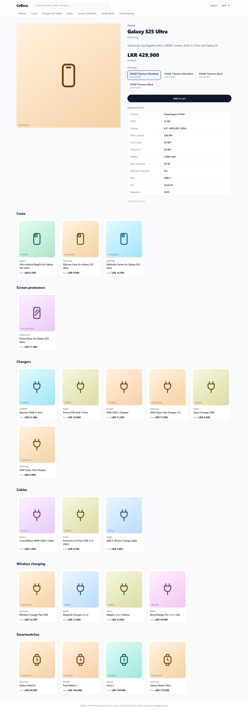

*Figure 5: A phone product page. The specification table is driven by kind-specific fields.*

### 5.4 Orders: embedded snapshots

An order embeds its line items (name, variant, unit price, quantity) and its delivery address **as they were at the time of purchase**. This is deliberate denormalisation: if a product is later renamed or repriced, past orders must not change. The customer is a **reference** (`customerId`), because a customer has an unbounded number of orders. Orders also store the `sessionId` of the session that produced them, so Support can jump from an order to the telemetry behind it.

📎 Evidence: `04-checkout/order-document.md`.

### 5.5 Events: a time-series collection and the `metaField` trade-off

Raw events live in a MongoDB **time-series collection**. MongoDB groups events that share the same `metaField` value and fall close together in time into internal **buckets**, and compresses them by column (MongoDB, 2026a). Cellora's `metaField` holds the event's identity: `{anonymousId, sessionId, customerId}`. That decision has consequences in both directions:

| Benefit | Cost |
|---|---|
| A session's events share buckets, so reading one session's timeline (UC12) is cheap | Many distinct meta values mean many small buckets: on average only **7.4 events per bucket** |
| Updates and deletes filtering on `meta` are supported, which is what identity stitching (§5.6) and erasure (UC15) need | Less compression than a low-cardinality `metaField` would give |

Measured on the 99,233 simulated events, the time-series collection used **9.4 MB on disk against 12.1 MB** for the same events in a regular collection (22% smaller), even with these small buckets. Its secondary indexes were larger, however (11.2 MB), because it carries four compound indexes that the plain copy did not have (Table 1).

| (Table 1) | Time-series | Regular collection |
|---|---|---|
| Units stored | 13,480 buckets | 99,233 documents |
| Data size (uncompressed) | 38.97 MB | 41.56 MB |
| On disk | **9.40 MB** | 12.09 MB |
| Index size | 11.16 MB (5 indexes) | 2.51 MB (`_id` only) |

*Table 1: Time-series vs regular collection storage. 📎 Evidence: `06-simulator/timeseries-storage.md`.*

Payload fields (`props`) differ per event type (a search has a query and result count; an add-to-cart has a SKU, quantity and price) and are **not indexed**. Analytical filters on them run over the rollups or over small time windows already narrowed by the `{type, ts}` index. An index per payload field would slow the write-heavy ingest path. New event types need no migration: only the shared Zod schema changes.

📎 Evidence: `05-telemetry/event-document.md`.

### 5.6 Identity stitching

A visitor is anonymous until they log in. Their browser gets a random `anonymousId` (localStorage), and each visit a `sessionId` (30 minutes of inactivity ends it). When they log in, the tracker sends an `identify` event, the anonymous id is added to the user's `anonymousIds` array, and the worker **back-fills** `meta.customerId` onto their earlier anonymous events with a single `updateMany` on the `metaField`. The analyst's funnel and the support timeline then see one continuous journey. In the evidence run, all 12 pre-login events were linked to the customer.

📎 Evidence: `05-telemetry/identity-stitching.md`.

### 5.7 Materialised views (rollups)

Three collections are maintained by the worker from raw events with aggregation pipelines ending in **`$merge`**. `$merge` upserts each result document into the target collection (MongoDB, 2026c).

- `session_summaries`: one document per session (landing page, device, how far down the funnel it got, failures, orders).
- `metrics_hourly`: event counts and distinct sessions per **Sri Lanka local hour** and event type.
- `funnel_daily`: the ordered funnel per local day, overall and per device.

The runs are **incremental**. Every 5 minutes only the recent window is recomputed, as whole hours or days, with a 10-minute overlap for late events. So the cost follows the volume of new data, not the total history (Table 9). Sri Lanka's UTC+5:30 offset required care: `$dateTrunc`'s time-zone option does not honour half-hour offsets for hourly units, so timestamps are shifted by 330 minutes before truncating and shifted back after.

📎 Evidence: `07-rollups/rollup-documents.md`.

### 5.8 Indexing

Compound indexes follow the **ESR guideline**: Equality fields first, then Sort, then Range. For example:

- The category listing uses `{kind: 1, basePrice: 1}`: equality on kind, sorted by price.
- The escalation queue uses `{flagged: 1, status: 1, createdAt: -1}`.

Every catalogue query was checked with `explain("executionStats")` against a forced collection scan (Table 2).

| (Table 2) Query | With index | Forced collection scan |
|---|---|---|
| Phones by price | IXSCAN `kind_1_basePrice_1`: 17 keys, 17 docs examined, 17 returned | 80 docs examined + in-memory SORT |
| Samsung products | IXSCAN `brand_1_kind_1`: 15 / 15 | 80 docs |
| Accessories for iPhone 16 Pro | IXSCAN `compatibleModels_1` (multikey): 4 / 4 | 80 docs |
| Product by slug | IXSCAN `slug_1` (unique): 1 / 1 | 80 docs |
| Text search "magsafe charger" | TEXT index: 12 keys, 22 docs, 11 returned | n/a |

*Table 2: Catalogue query plans. 📎 Evidence: `02-catalog/query-plans.md`.*

Building the dashboards exposed one mistake. `metrics_hourly` has a compound `_id: {hour, type}`, and **the `_id` index cannot serve a range on `_id.hour` alone**, so the hourly trends query was a collection scan. A dedicated `{"_id.hour": 1}` index fixed it. The Admin's index page (UC6, Figure 12) shows each index's size and how often it has been used since the server started (`$indexStats`), which exposes unused indexes.

---

## 6. Implementation

### 6.1 Storefront and catalogue (UC8, UC9)

The storefront lists products by category with faceted filters. Brand and price facets are computed in one query with `$facet`. It also provides product pages with a variant picker and compatible accessories in both directions, and weighted text search (name 10, brand 5, description 1).

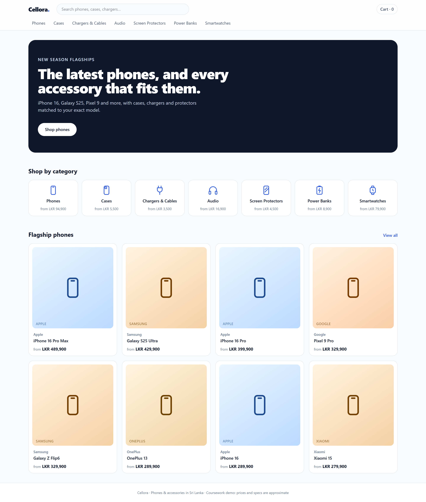

*Figure 6: Storefront home page. Also available: `02-catalog/storefront-category-filtered.png`, `storefront-search.png`, `storefront-product-accessory.png`.*

### 6.2 Carts and sessions in Redis (UC10, UC4)

- **Carts.** A cart is a Redis hash of `sku → quantity` with a 30-day TTL that is refreshed on every change. **Prices are deliberately not stored in the cart**: they are joined from MongoDB whenever the cart is shown and again at checkout, so a cart can never lock in a stale price. When a guest logs in, their cart is merged into the account's cart with `HINCRBY` and deleted.
- **Sessions.** A session is a Redis hash with a TTL (7 days for customers, 8 hours for staff), listed in a per-user set. That set makes **instant revocation** possible. When an admin revokes a user, or changes their role, every session key is deleted and the user's very next request is anonymous (evidence: 5 sessions revoked; the same cookie immediately returned `user: null`).

📎 Evidence: `03-auth-cart/guest-cart-merge.md`, `03-auth-cart/session-revocation.md`, `08-dashboards/role-change-revokes.md`, `03-auth-cart/cart-page.png`.

### 6.3 Checkout without overselling (UC11)

The critical invariant is that **stock can never go below zero, even with simultaneous buyers**. Two mechanisms enforce it.

**1. A conditional atomic update.** Instead of reading the stock and checking it in code, the check *is* the update's filter:

```ts
await Product.updateOne(
  { _id: line.productId, variants: { $elemMatch: { sku: line.sku, stock: { $gte: line.qty } } } },
  { $inc: { "variants.$.stock": -line.qty } },   // "$" = the variant matched by $elemMatch
  { session },
);
if (r.matchedCount === 0) throw new OutOfStock(line.sku);  // → abort and roll back
```

MongoDB applies filter and update to one document atomically, so only one buyer can observe `stock ≥ 1`. The `$jsonSchema` validator additionally rejects negative stock as a database-level safety net.

**2. A multi-document transaction.** An order may contain several products, and the order document must exist only if *every* decrement succeeded. The decrements and the order insert therefore run inside `session.withTransaction()` with `readConcern: "snapshot"` and `writeConcern: "majority"`. The driver retries automatically on transient write conflicts.

| (Table 3) Test | Result |
|---|---|
| 20 parallel checkouts for the **last unit** of a phone | **1 × 201 Created, 19 × 409 Sold out**, 1 order, stock 1 → 0, in 353 ms |
| Naive read-then-write (check in code, then `$set stock − 1`), same race | **18 units "sold" of 1**: oversold by 17 |
| Transaction: charger decremented, then phone sold out → abort | Charger stock 108 → 107 inside → **108 after abort** (rolled back) |

*Table 3: Checkout correctness. 📎 Evidence: `04-checkout/checkout-race.md`, `oversell-naive-vs-atomic.md`, `transaction-rollback.md`.*

Order numbers come from an atomic counter document (`findOneAndUpdate` with `$inc`), deliberately **outside** the transaction. A retried transaction then does not reuse numbers, at the cost of occasional gaps. Payment is simulated: cash on delivery, or a card outcome chosen from a menu. No card data is collected.

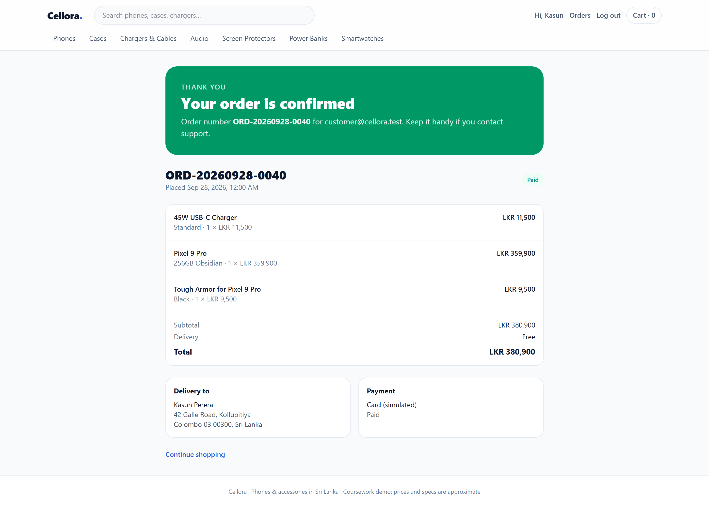

*Figure 7: Order confirmation.*

### 6.4 The telemetry pipeline

The browser tracker records the storefront events (§3.2) and batches them. The API validates **each event individually** against a shared Zod schema, so one malformed event doesn't reject its batch. Order events (`order_placed`, `checkout_failed`) are emitted **only by the server**, because anything a browser sends can be forged. Accepted events are appended to the stream in one pipelined round trip and the API replies 202.

The worker implements an **at-least-once** consumer (simplified):

```ts
const res = await redis.xreadgroup("GROUP", GROUP, consumer, "COUNT", 500, "BLOCK", 2000, "STREAMS", STREAM, ">");
await events.insertMany(docs, { ordered: false });   // one round trip per batch
await updateLiveCounters(docs);                       // PFADD active:{min}, INCR evt:{type}:{min}
await redis.xack(STREAM, GROUP, ...ids);              // acknowledge only after MongoDB has the data
```

If the worker crashes between insert and acknowledge, the entries stay *pending* and are reclaimed (`XAUTOCLAIM`) and inserted again. This is why duplicates are possible (§10.3). A best-effort de-duplication skips event ids inserted in the last hour. Unparseable entries go to a dead-letter stream instead of blocking the pipeline.

| (Table 4) Ingestion test, 20,000 events | Result |
|---|---|
| Accepted by the API | 660 ms (**30,303 events/s**) |
| Stored in MongoDB, end to end | 3,171 ms (**6,307 events/s**) |
| Consumer group after draining | 0 pending, 0 lag |

*Table 4: Ingestion throughput on one laptop (indicative, not a benchmark). 📎 Evidence: `05-telemetry/ingest-throughput.md`, `stream-and-counters.md`, `session-timeline.md`.*

The API accepts events five times faster than the database stores them. The stream absorbs the difference. That is the point of the design, and it matters even more when the database is unavailable (§9.4).

### 6.5 The ordered funnel and rollups (UC2)

A funnel counts sessions that reached each step **in order**: product view → add to cart → checkout → order. Counting sessions per event type ignores order and overstates conversion. The pipeline works in stages:

1. `$group` by session, taking the **first time** each step happened with `$min` of a `$cond`. `$min` ignores nulls, so steps that never happened stay null.
2. Mark a step as reached only if the previous step happened **earlier**.
3. Group by local day and device, and `$merge` into `funnel_daily`.

```js
{ $group: { _id: "$meta.sessionId", first: { $min: "$ts" }, device: { $max: "$device.type" },
            view: { $min: { $cond: [{ $eq: ["$type", "product_view"] }, "$ts", null] } }, … } },
{ $set: { s2: { $and: ["$s1", { $ne: ["$cart", null] }, { $gte: ["$cart", "$view"] }] } } }, …
```

The pipeline was verified on a **hand-made dataset with known answers**: ten sessions covering steps out of order, duplicates, a skipped step, an order without a product view, and a session crossing local midnight. All six day-by-device results matched the hand-worked figures. On the same data, naive per-type counting reports **50% conversion where the true ordered funnel gives 17%** (📎 `09-testing/funnel-correctness.md`). In addition, the rollup's numbers on the real 14-day dataset equal the same computation over raw events at every step (📎 `07-rollups/raw-vs-rollup-vs-cache.md`).

### 6.6 Analyst dashboards (UC1–UC3)

- **Live activity** reads Redis only: `PFCOUNT` over the last five per-minute HyperLogLogs gives *unique* active sessions, and per-minute counters give event rates.
- **Funnel** and **trends** read the rollups.
- **Top products and searches**, including searches that returned nothing, aggregate raw events over the `{type, ts}` index.
- **Export:** every report can be downloaded as CSV or JSON.

All of these go through the read-only user to a secondary node (the evidence shows the analyst query served by `:27019` while the primary was `:27017`, and an insert through that connection rejected as *not authorized*).

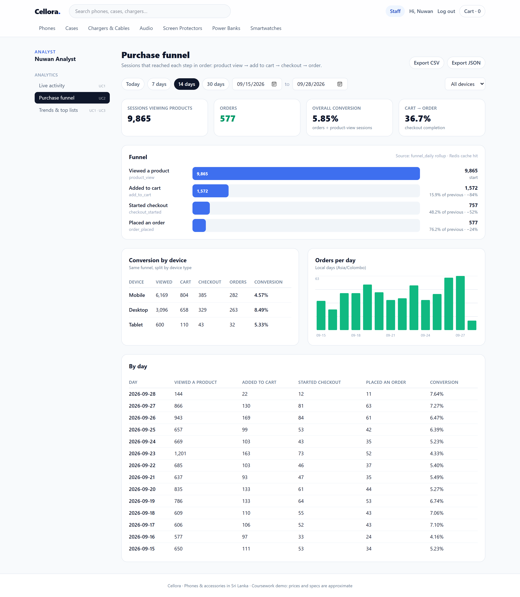

*Figure 8: Analyst purchase funnel. Over 14 days, 10,160 sessions viewed a product and 596 ordered (5.87%); desktop converts at 8.56% against 4.58% on mobile.*

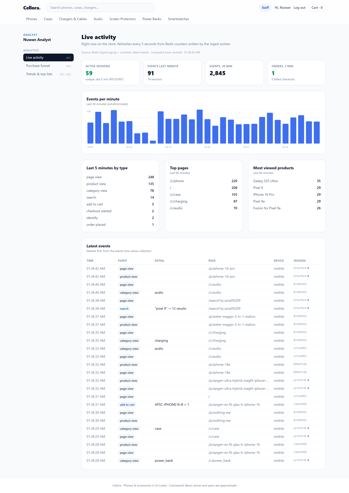

*Figure 9: Live activity. Also: `analyst-trends.png` (hourly trend with the evening peak and zero-result searches).*

📎 Evidence: `08-dashboards/analyst-connection.md`, `live-hyperloglog.md`, `export.md`.

### 6.7 Support dashboards (UC12–UC14)

Support finds a customer by email prefix (an index range scan), order number, or an anonymous or session id read from the customer's device. The **customer view** combines:

- The profile.
- Their orders.
- Their **live cart from Redis**, priced from MongoDB.
- All their sessions, including anonymous sessions from *before* they signed up, found through the stitched anonymous ids.
- Their notes.

A **session timeline** replays the raw events of one session in order. It is served by the `{meta.sessionId, ts}` index and, because the session shares time-series buckets, is always up to the second. Agents can annotate and flag a session. Flagged notes form an escalation queue. A failed-checkouts queue lists recent `checkout_failed` events with the reason, and whether the customer recovered in the same session.

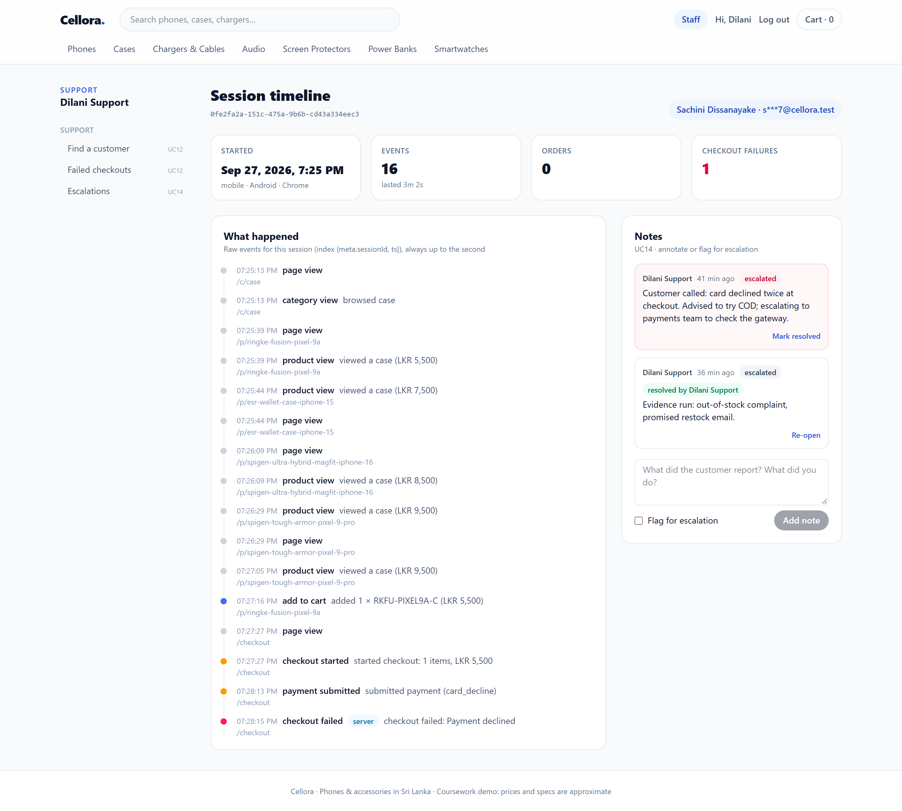

*Figure 10: Session timeline and notes. Also: `support-customer.png`, `support-failed-checkouts.png`, `support-escalations.png`, `support-order-masked.png`.*

📎 Evidence: `08-dashboards/escalations.md`, `pii-masking.md`.

### 6.8 Administration (UC4–UC7, UC15)

- **Users & access (UC4):** change roles, disable accounts, revoke sessions. Every change is written to `audit_log`.
- **Retention (UC5):** saving "keep raw events for N days" runs `collMod` on the time-series collection's `expireAfterSeconds`. MongoDB then deletes whole buckets once all their events have expired, with no cron job or batch deletes in application code.
- **Indexes and rollups (UC6):** index definitions, sizes and usage counts; the last rollup run; and a **rebuild** button. The API only sets a flag in Redis and returns *202 Accepted*, and the worker performs the rebuild (about 0.9 s) within 15 seconds.
- **Health (UC7):** replica set members and replication lag (`replSetGetStatus`), server counters (`serverStatus`), data size against compressed size on disk, Redis `INFO`, and the stream backlog (`XINFO GROUPS`).
- **Right to erasure (UC15)** is described in §10.2, where it illustrates a limitation.

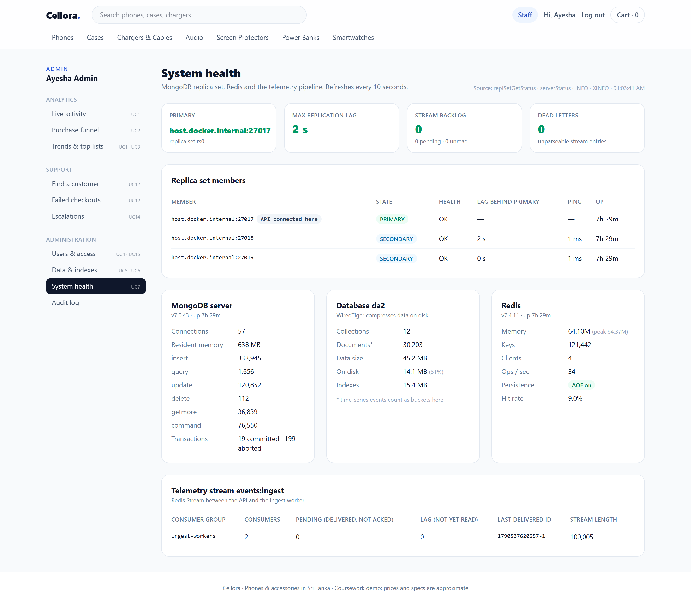

*Figure 11: System health. Also: `admin-users.png`, `admin-audit.png`.*

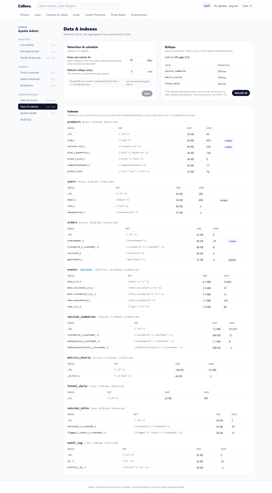

*Figure 12: Retention setting (UC5), rollup status with the rebuild button, and every index with its size and `$indexStats` usage (UC6).*

📎 Evidence: `08-dashboards/retention-collmod.md`, `rollup-rebuild.md`, `role-change-revokes.md`.

### 6.9 Traffic simulator

A seeded simulator generates realistic behaviour:

- A device mix (62% mobile).
- Drop-off probabilities at each funnel step (higher on mobile).
- Bounces, searches (including ones that return nothing), accessory browsing after phones.
- Returning customers who log in, declined payments and sold-out items.

In **backfill** mode it wrote 14 days of history (12,987 sessions, 99,233 events, 609 orders) *through the real Redis stream and worker*, with back-pressure when the stream lag grows. In **live** mode it drives the real HTTP API for demonstrations.

📎 Evidence: `06-simulator/dataset-overview.md`, `behaviour-breakdowns.md`.

---

## 7. Characteristics of NoSQL demonstrated

### 7.1 Flexible schema, with validation where it matters

Seven product kinds with different attributes live in one collection, and event payloads differ by type. Neither needed a migration when new kinds or events were added. Flexibility is not the same as having no rules, however.

The `products` collection has a `$jsonSchema` validator on the fields every product shares. The test accepted a product with an attribute no other product has, but rejected negative stock, an unknown kind, a missing `variants` array, and a price stored as a string (📎 `02-catalog/schema-validation.md`). Kind-specific rules are checked by the application (Mongoose discriminators and Zod), so a new kind still needs no database change. This is the **schema-on-read / schema-on-write hybrid** of §2.6: the database guards the invariants that must never break, and the application owns the details that change.

### 7.2 Aggregate orientation and denormalisation

Data is stored in units that match how it is used: a product with its variants, an order with its lines and address. An order is written and read as one document, with no joins. The price is **copies**:

- The product's `basePrice` copies its cheapest variant.
- Events copy the price and kind at the time.
- Rollups copy aggregates of the events.

Each copy is listed in a register with the rule that keeps it correct (📎 `docs/data-model.md` §9). §10.1–10.2 discuss what this costs.

### 7.3 Distribution and replication

The database is a three-node replica set:

- **Writes go to the primary, whose oplog the secondaries replay.**
- Reads can be spread: analyst queries run on a secondary (§6.6).
- If the primary fails, the others **elect** a new one, and the application's driver follows automatically. This was tested by killing the primary under load (§9.4).

Replication is also the prerequisite for multi-document transactions in MongoDB.

### 7.4 Tunable consistency

Consistency is chosen per operation rather than once for the whole system:

| Data | Write concern / read preference | Consistency | Why |
|---|---|---|---|
| Orders and stock | Transaction, `w: "majority"`, snapshot reads | Strong (ACID) | Money and stock must be exact |
| Telemetry events | `w: 1`, unordered batches | Durable on the primary; at-least-once | Throughput over perfection |
| Analyst reads | `secondaryPreferred` | May lag by replication delay | Keep load off the primary |
| Support reads | Primary | Read-your-writes | An agent must see the note they just saved |

### 7.5 Eventual consistency (BASE)

The dashboards are deliberately **eventually consistent**. Rollups refresh every 5 minutes and the cache holds results for up to 60 seconds. The evidence captures a new order that was visible in raw events at once, while the rollup still showed the old count until its next run (Table 5). For analytics this is an acceptable price for speed (§9.5). For stock it would not be, which is why checkout does not use it.

| (Table 5) | Raw events | `funnel_daily` rollup |
|---|---|---|
| Before a new order | 8 | 8 |
| New order placed | **9** | 8 ← stale |
| After the next rollup run | 9 | **9** ← consistent again |

*Table 5: Eventual consistency observed. 📎 Evidence: `07-rollups/eventual-consistency.md`.*

### 7.6 Specialised data structures

Redis is more than a key-value cache: each structure fits one job.

- **Hashes:** carts and sessions.
- **Sets:** a user's sessions.
- **Strings with TTL:** the cache.
- **Counters:** events per minute.
- **A stream with consumer groups:** a durable, replayable queue.
- **HyperLogLog:** counting *distinct* visitors in about 12 KB per key, whatever their number (Flajolet *et al.*, 2007).

`PFCOUNT` over five per-minute keys returns the size of their **union**, so a visitor active in several minutes counts once. In the evidence run the estimate was **57, exactly the true distinct count** from MongoDB, while naively summing the minutes gave 67 (📎 `08-dashboards/live-hyperloglog.md`).

### 7.7 Built-in data lifecycle (TTL)

Expiry is a database feature, not application code:

- Raw events expire after the configured retention (UC5).
- Carts after 30 days of inactivity, and sessions after 7 days or 8 hours.
- Cached results after 60 seconds.
- Live counters after 2 hours.

### 7.8 A different security model

MongoDB's role-based access control grants built-in or custom roles per database, which is comparable to SQL `GRANT`s but coarser: privileges apply to databases and collections, not individual fields (read-only views can approximate field-level access). Cellora combines:

- Database users with least privilege (the analyst user can only read).
- Application roles on every endpoint.
- Field masking in API responses (support sees `c***r@cellora.test` and `••• ••• 4567`; admin sees everything).
- An audit log of privileged actions.

📎 Evidence: `08-dashboards/pii-masking.md`, `01-foundation/database-access-control.md`.

---

## 8. Applications of NoSQL

NoSQL databases are used across industry wherever data is high-volume, varied or needs specialised access. Table 6 maps common applications to where they appear in Cellora.

| (Table 6) Application area | Typical use | Industry example | In Cellora |
|---|---|---|---|
| **Product catalogues** | Items with differing attributes, rich filtering | E-commerce and marketplaces | `products` with 7 kinds (§5.3) |
| **Sessions and shopping carts** | Fast per-user state with expiry | Amazon's shopping cart was the motivating example for Dynamo (DeCandia *et al.*, 2007) | Redis sessions and carts (§6.2) |
| **Caching** | Serving expensive results from memory | Almost every large website | Redis read-through cache for dashboards |
| **Event, IoT and telemetry data** | High-rate append, time-range queries, expiry | Clickstreams, sensor readings, application logs, monitoring | `events` time-series collection and ingestion pipeline (§5.5, §6.4) |
| **Real-time analytics** | Live counters, unique-visitor counts, leaderboards | Live dashboards, gaming, ad tech | Redis counters and HyperLogLog (§6.6) |
| **Message queues and event streaming** | Decoupling producers from consumers | Order processing, notification pipelines | Redis Stream with a consumer group (§6.4) |
| **Pre-aggregated reporting** | Materialised views for dashboards | Business intelligence at scale | `$merge` rollups (§5.7) |
| **Content and user profiles** | Semi-structured, evolving records | Content management, user profile stores | `users` with embedded addresses and linked ids |
| **Graphs** | Relationships as first-class data | Social networks, fraud detection, recommendations | Not needed (§4.3); compatibility is a simple array |
| **Wide-column at massive scale** | Petabyte-scale write-heavy data | Messaging and time-series at very large companies | Not needed at this scale (§4.3) |

The last two rows matter as much as the first eight. Choosing NoSQL is about matching a data model to an access pattern, and the fact that Cellora needed a document store and a key-value store, but not a graph or wide-column store, is a result of that analysis rather than a gap.

---

## 9. Strengths

Each strength below is backed by a measurement from the running system. The results were gathered on one laptop running all three database nodes in Docker, so absolute numbers are indicative. The comparisons between approaches are the point.

### 9.1 Schema flexibility without migrations

New product kinds and new event types were added during development with no `ALTER TABLE` and no downtime. The catalogue query code is shared by all kinds. The validator still protects the invariants (§7.1). A relational design would need either sparse columns or one table per kind, plus migrations (§11.4).

### 9.2 Fast reads through query-driven modelling

Because documents are shaped for their queries and indexed accordingly:

- Every catalogue query examined only the documents it returned: 17 of 80, 4 of 80, 1 of 80 (Table 2).
- A whole product, with all variants, is one read.
- A whole order is one read.
- A session timeline is one indexed range read.

### 9.3 High write throughput through decoupled ingestion

The event API accepted **30,303 events/s**, five times faster than the end-to-end rate (6,307 events/s, Table 4), because it only appends to a Redis stream. The storefront's responsiveness does not depend on the database's write speed. Batching (500 events per `insertMany`) keeps the database side efficient.

### 9.4 High availability through replication

The primary's container was **killed** (a crash, not a clean shutdown) while reads, telemetry and checkouts ran continuously (Figure 13, Table 7).

| (Table 7) | Result |
|---|---|
| New primary elected after | **10.7 s** (10.3–11.4 s across runs) |
| Catalogue reads (113) | **0 failed**; the slowest waited 10.1 s during the election, then succeeded |
| Checkouts (29) | **0 failed**; the slowest 10.2 s |
| Telemetry batches (113) | **0 failed**; never slower than 36 ms |
| Events accepted → stored | **565 → 565** (none lost) |
| Old primary restarted | Rejoined as a secondary in about 1 s and caught up from the oplog |

*Table 7: Failover under load. 📎 Evidence: `09-testing/failover-under-load.md` (includes a per-second timeline).*

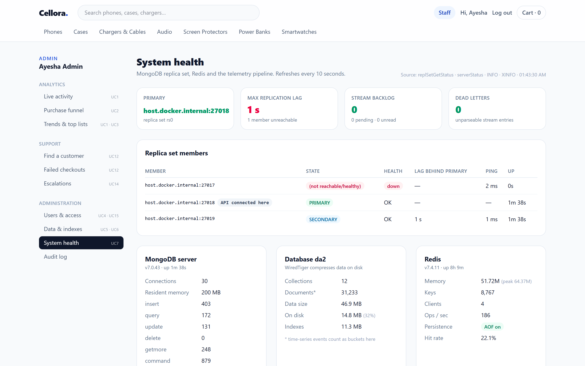

*Figure 13: During the failover. Also: `failover-health-after.png`.*

The application needed no code for this: the MongoDB driver discovers the new primary by itself. One configuration change was needed, and the test found it. The driver's server-selection timeout was 10 s, but elections took up to 11.4 s, so a slower election would have turned waiting requests into errors. It was raised to 20 s.

### 9.5 Speed through pre-aggregation and caching

| (Table 8) 14-day funnel | Time |
|---|---|
| Ordered-funnel pipeline over 93,994 raw events | 144 ms |
| Read 14 `funnel_daily` documents (secondary) | **2.2 ms** (65× faster) |
| API, Redis cache miss | 14 ms |
| API, Redis cache hit | 2.5 ms |

*Table 8: Raw vs rollup vs cache, with identical results at every step. 📎 Evidence: `07-rollups/raw-vs-rollup-vs-cache.md`, `08-dashboards/dashboard-timings.md`.*

The raw query's cost grows with every event stored. The rollup's cost grows only with the number of days. Keeping the rollups up to date is cheap as well, because runs are incremental (Table 9).

| (Table 9) Rollup | Documents | Full rebuild | Incremental run |
|---|---|---|---|
| `session_summaries` | 12,984 | 403 ms | 15 ms |
| `metrics_hourly` | 2,601 | 144 ms | 3.5 ms |
| `funnel_daily` | 15 | 178 ms | 20 ms |

*Table 9: Rollup cost. 📎 Evidence: `07-rollups/rollup-run-cost.md`.*

### 9.6 Atomic single-document operations

Because a product and its variants form one document, the stock check and decrement are **one atomic operation** (Table 3). Many problems that need a transaction in a normalised schema need none here: adding a note, updating a counter, merging a cart line.

### 9.7 Built-in data lifecycle

Retention is one `collMod` (📎 `08-dashboards/retention-collmod.md`). MongoDB and Redis expire data themselves (§7.7), which keeps storage bounded without maintenance code.

### 9.8 One data format from browser to database

Events and API responses are JSON from the React app through the API to MongoDB, described by one set of TypeScript/Zod schemas shared by browser, API and worker. There is no object-relational mapping layer translating between objects and tables.

---

## 10. Limitations

### 10.1 No referential integrity and no joins

MongoDB has no foreign keys:

- An order's `customerId` or an event's `productId` can point at a document that no longer exists, and the database will not object.
- Integrity is the application's job. The analyst's "top products" shows "(deleted product)" if a referenced product disappears.
- `$lookup` provides left-outer joins inside aggregations, but it cannot use the time-series bucket structure efficiently and is not a substitute for relational joins in ad-hoc queries.
- Events that stored the product id as a string needed a `$toObjectId` conversion to join at all, a small example of how weakly typed references drift.

### 10.2 Denormalisation costs storage and makes erasure hard

Copies make reads fast but spread each fact across the database. The right-to-erasure request (UC15) shows the cost clearly. One customer's personal data sits in:

- The `users` document.
- Their orders (snapshots of name, email, phone and address).
- Their telemetry events (in the `metaField`, including anonymous events from before they signed up, linked only through stitched ids).
- Their session summaries.
- Support notes.
- Their Redis sessions and cart.

The erasure therefore:

1. Deletes events by `meta.customerId` **and** every linked `meta.anonymousId`.
2. Deletes their summaries and notes.
3. **Pseudonymises** orders instead of deleting them, because financial records must be kept: items and totals stay, while name, email, phone and street are removed.
4. Revokes sessions and deletes the cart.
5. Replaces the user record with a placeholder.
6. Writes an audit entry that records counts only.

It **cannot run in one transaction**, because writes to time-series collections are not allowed inside multi-document transactions and Redis is outside MongoDB anyway. Every step is instead **idempotent**, and the user record, which holds the anonymous ids needed to find everything else, is changed last. A failed erasure can simply be run again. The evidence runs it twice: the second run changed nothing.

Some copies remain out of reach:

- Events still in the Redis stream until it is trimmed.
- The oplog.
- Backups.
- The live HyperLogLogs. No member can be removed from a HyperLogLog, although it stores only hashed register values and expires within two hours.

In a normalised relational schema, most of this would be a delete that cascades from one row.

📎 Evidence: `08-dashboards/right-to-erasure.md` (before/after counts, order and user documents before and after, audit entry).

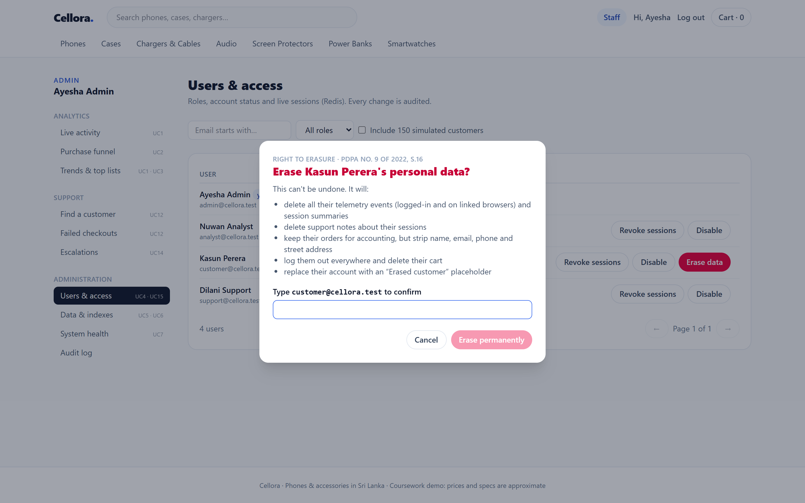

*Figure 14: Right-to-erasure confirmation (PDPA s.16).*

### 10.3 At-least-once delivery means possible duplicates

The ingestion pipeline never loses an accepted event (§9.4, §10.5), but it can store one **twice**: a worker that crashes after inserting but before acknowledging will insert the batch again. Time-series collections cannot have unique indexes, so the database cannot reject the duplicate. The worker's de-duplication cache catches most redeliveries within an hour but is not a guarantee. Analytics must tolerate a small over-count. That is acceptable for behaviour trends but would not be for billing.

### 10.4 Transactions are narrower than in relational databases

Multi-document transactions work (Table 3), but:

- They need a replica set.
- They add latency.
- They are limited in duration.
- They cannot include time-series writes (§10.2).

The design therefore keeps them to the one place that needs them (checkout) and relies on single-document atomicity elsewhere. A relational database treats multi-row transactions as the normal case.

### 10.5 Without a majority, there is no write availability

MongoDB favours consistency when the replica set is split (CP, §2.5). Killing **two of the three** members showed this directly (📎 `09-testing/majority-loss.md`):

- The survivor reported `secondary: true, primary: null` and **refused to become primary**, because doing so could create two primaries accepting conflicting writes ("split brain").
- Catalogue reads (128 of 242) and checkouts (34 of 62) **failed** with HTTP 500 once the 20-second timeout ran out.
- **Telemetry kept working**: 1,210 events were accepted during the outage and all 1,210 reached MongoDB after the nodes returned. The worker retried its pending batch until a primary was back.

The telemetry side behaves as an AP system because of the Redis stream. The shop itself cannot sell while the majority is lost.

The same test found a real defect: the worker originally **crashed** on the first failed insert. It now keeps the batch pending and retries it.

### 10.6 Ad-hoc analysis and text search

- **Ad-hoc analysis:** every dashboard here was designed in advance, with a matching index or rollup. A new question ("conversion by landing page for returning customers") needs a new aggregation pipeline, and possibly a new index or rollup. It cannot simply be written as SQL against normalised tables. The flexibility in *storing* data does not extend to *querying* it.
- **Text search:** MongoDB's text index is basic. It matches **any** of the words, so "iphone 17" returned 25 results including every iPhone. It has no typo tolerance, and relevance tuning is limited to field weights. A larger catalogue would justify a search engine (§11.5).

📎 Evidence: `06-simulator/behaviour-breakdowns.md` (search result counts).

### 10.7 Design decisions are hard to change

The time-series `metaField` choice (§5.5) is fixed when the collection is created. Changing it means creating a new collection and copying every event. Poor early modelling decisions in NoSQL cost more to reverse than a relational index or view, because the data's physical layout follows the query design.

### 10.8 Redis durability and a single point of failure

Redis keeps data in memory. With `appendfsync everysec`, up to about one second of writes could be lost in a crash. The configuration has a single Redis instance, which is a single point of failure for sessions, carts and ingestion.

📎 Evidence: `01-foundation/redis-persistence.md`.

### 10.9 Operational complexity and skills

The system has more moving parts than a single relational database: a replica set with keyfile authentication, a stream, a worker, rollups and a cache, each with failure modes. It also needs different skills, such as aggregation pipelines, index design for documents, and eventual consistency reasoning, where SQL skills are more widely held.

---

## 11. Evaluation

### 11.1 Testing

| Level | What | Result | Evidence |
|---|---|---|---|
| Unit tests (`npm test`) | Event schema validation (including forged server events), PII masking, password hashing, time keys | 11 / 11 pass | `09-testing/unit-tests.md` |
| Query correctness | Funnel pipeline on a hand-made dataset with known answers | 6 / 6 pass | `09-testing/funnel-correctness.md` |
| Rollup correctness | Rollup vs raw computation, 14 days | Identical at every step | `07-rollups/raw-vs-rollup-vs-cache.md` |
| Concurrency | 20 simultaneous checkouts, last unit | Exactly 1 sale | `04-checkout/checkout-race.md` |
| Access control | Every role × every protected endpoint | 401 / 403 / 200 as designed | `03-auth-cart/rbac-matrix.md`, `08-dashboards/rbac-dashboards.md` |
| Data protection | Erasure end to end, run twice | All personal data removed; second run a no-op | `08-dashboards/right-to-erasure.md` |
| Resilience | Primary crash under load; majority loss | 0 failed requests; 0 lost events | `09-testing/failover-under-load.md`, `majority-loss.md` |

The evidence is **reproducible**: each row is regenerated by one command (`npm run evidence -- <set>`). Testing also **found and fixed defects**:

- The worker crashing on database errors.
- Unhandled promise rejections in timers.
- A driver timeout shorter than an election.
- A collection scan on `metrics_hourly`.
- A per-row date-formatting call that made one dashboard seven times slower.

### 11.2 Requirements traceability

All fifteen use cases are implemented and demonstrated. §3.2 maps each to its NoSQL feature, §6 describes each, and Appendix C lists each one's evidence. Two optional items were deliberately left out: an in-app `explain()` viewer (the query plans are in the evidence instead) and automated end-to-end browser tests (the scripted evidence sets serve that purpose).

### 11.3 Comparison with a relational design

A fair comparison is with a modern relational database such as PostgreSQL, which also offers JSON columns and table partitioning.

| Concern | Relational design | This NoSQL design | Verdict |
|---|---|---|---|
| Product kinds | Parent table + one table per kind, or a JSONB column | One polymorphic collection | NoSQL simpler; PostgreSQL JSONB comes close |
| Orders | `orders` + `order_items` (snapshot columns) + FKs | One document with embedded snapshot | Equivalent; NoSQL avoids a join, SQL gives FKs |
| Stock correctness | `UPDATE … WHERE stock >= qty` in a transaction | Conditional update in a transaction | Equivalent; SQL is the more natural fit |
| Telemetry storage | Time-partitioned table, BRIN index, or TimescaleDB | Time-series collection | Comparable; NoSQL gives it without extensions |
| Ingestion | Needs a queue anyway to decouple writes | Redis Stream | Same architecture either way |
| Funnels | Window functions or self-joins; materialised views | Aggregation pipeline + `$merge` | SQL more expressive for ad-hoc; both need pre-aggregation at scale |
| Integrity | Foreign keys, cascades | Application-enforced | **Relational stronger** |
| Erasure | Mostly cascading deletes | Multi-step, idempotent, across stores | **Relational simpler** |
| Horizontal scale | Harder (sharding extensions, distributed SQL) | Built-in replication; sharding available | **NoSQL stronger** at large scale |
| Schema change | Migrations | None for new kinds and event types | **NoSQL stronger** |

**The honest conclusion:** at Cellora's current size, a well-designed PostgreSQL system would also work. NoSQL's advantages here are in **write decoupling and throughput, schema evolution, built-in replication and TTL, and specialised structures** (streams, HyperLogLog). They would grow with traffic and catalogue variety. Its disadvantages in **integrity, ad-hoc querying and erasure** are real now and do not shrink with scale.

### 11.4 Critical reflection

- **What worked well:**
  - Starting from the use cases and choosing a store per access pattern kept the design justified.
  - Decoupling ingestion through a stream paid off twice: in throughput and when the database was unavailable.
  - Generating evidence with scripts made every claim in this report reproducible.
- **What I would do differently:**
  - Measure time-series bucket fill earlier, before the collection held data. A lower-cardinality `metaField` (for example the event type) would give larger, better-compressed buckets, but per-session reads and erasure by customer would then rely on secondary indexes instead of bucket grouping. That trade-off should have been tested, not assumed.
  - Store product ids in events as ObjectIds rather than strings.
  - Design erasure in from the first schema rather than retrofitting it.

### 11.5 Scaling to 100× traffic

| Component | Change | Reason |
|---|---|---|
| `events` | **Shard** on `{ "meta.sessionId": "hashed" }` | Spreads writes evenly across shards; a session timeline still targets one shard. Funnels scatter-gather, but read from rollups |
| `orders` | Shard on `customerId` (hashed), or leave unsharded longer | A customer's history stays on one shard |
| `products` | Leave unsharded; add read replicas | Small, read-heavy |
| Redis | Redis Cluster; **split the stream** into several (`events:ingest:{0..n}`) with a worker per partition | One stream lives on one node; partitioning parallelises ingestion |
| Redis availability | Replicas with Sentinel, or a managed service | Removes the single point of failure (§10.8) |
| Search | A dedicated search engine | Typo tolerance, relevance, facets (§10.6) |
| Analytics history | Keep rollups in MongoDB; export raw events to a columnar warehouse | Long-horizon ad-hoc analysis (§10.6) |

At the point where tens of thousands of events per second must be stored **durably across data centres**, the case for a wide-column store such as Cassandra, rejected in §4.3, would become worth re-examining.

---

## 12. Conclusion and future work

Cellora shows that choosing NoSQL is a series of trade-offs made per use case, not a single decision.

- **MongoDB** gave the catalogue a flexible yet validated schema, gave orders self-contained snapshots, and gave telemetry a compressed, self-expiring time-series store. Its aggregation pipeline and `$merge` turned 144 ms queries into 2 ms reads. Its replica set survived the loss of its primary under load without a single failed request. Where strong consistency mattered, atomic updates and transactions sold exactly one last unit to twenty simultaneous buyers.
- **Redis** earned its place five times over: decoupled ingestion (which kept accepting telemetry even with the database down), live unique-visitor counts in a few kilobytes, instant session revocation, carts and caching.

The same system made the limitations concrete:

- No referential integrity.
- A right-to-erasure request under Sri Lanka's PDPA that must hunt personal data through denormalised copies without a transaction.
- Duplicate events under at-least-once delivery.
- Eventual consistency in the dashboards.
- No writes at all without a majority.

**Future work:**

- Sharding and a partitioned stream (§11.5).
- Redis high availability.
- A search engine.
- A data warehouse for ad-hoc analysis.
- Automated browser tests.
- Tracking the PDPA's remaining commencement orders, so that the erasure process and its response times meet the Act and the Authority's rules when Part II takes effect.

---

## References

Abadi, D. (2012) 'Consistency tradeoffs in modern distributed database system design: CAP is only part of the story', *Computer*, 45(2), pp. 37–42.

Brewer, E. (2000) 'Towards robust distributed systems', keynote at the *19th ACM Symposium on Principles of Distributed Computing (PODC)*, Portland, Oregon, 16–19 July.

Brewer, E. (2012) 'CAP twelve years later: how the "rules" have changed', *Computer*, 45(2), pp. 23–29.

Cattell, R. (2011) 'Scalable SQL and NoSQL data stores', *ACM SIGMOD Record*, 39(4), pp. 12–27.

Chang, F., Dean, J., Ghemawat, S., Hsieh, W.C., Wallach, D.A., Burrows, M., Chandra, T., Fikes, A. and Gruber, R.E. (2006) 'Bigtable: a distributed storage system for structured data', in *Proceedings of the 7th USENIX Symposium on Operating Systems Design and Implementation (OSDI '06)*, pp. 205–218.

Codd, E.F. (1970) 'A relational model of data for large shared data banks', *Communications of the ACM*, 13(6), pp. 377–387.

Data Protection Authority of Sri Lanka (2026) *Data Protection Authority, Sri Lanka*. Available at: https://www.dpa.gov.lk/ (Accessed: 28 September 2026).

DeCandia, G., Hastorun, D., Jampani, M., Kakulapati, G., Lakshman, A., Pilchin, A., Sivasubramanian, S., Vosshall, P. and Vogels, W. (2007) 'Dynamo: Amazon's highly available key-value store', in *Proceedings of the 21st ACM Symposium on Operating Systems Principles (SOSP '07)*, pp. 205–220.

European Parliament and Council of the European Union (2016) *Regulation (EU) 2016/679 (General Data Protection Regulation)*, *Official Journal of the European Union*, L 119, 4 May, pp. 1–88.

Flajolet, P., Fusy, É., Gandouet, O. and Meunier, F. (2007) 'HyperLogLog: the analysis of a near-optimal cardinality estimation algorithm', in *Proceedings of the 2007 Conference on Analysis of Algorithms (AofA '07)*. Discrete Mathematics and Theoretical Computer Science Proceedings.

Gilbert, S. and Lynch, N. (2002) 'Brewer's conjecture and the feasibility of consistent, available, partition-tolerant web services', *ACM SIGACT News*, 33(2), pp. 51–59.

Härder, T. and Reuter, A. (1983) 'Principles of transaction-oriented database recovery', *ACM Computing Surveys*, 15(4), pp. 287–317.

Kleppmann, M. (2017) *Designing Data-Intensive Applications*. Sebastopol, CA: O'Reilly Media.

Lakshman, A. and Malik, P. (2010) 'Cassandra: a decentralized structured storage system', *ACM SIGOPS Operating Systems Review*, 44(2), pp. 35–40.

MongoDB (2026a) *Time series collections*. MongoDB Manual. Available at: https://www.mongodb.com/docs/manual/core/timeseries-collections/ (Accessed: 28 September 2026).

MongoDB (2026b) *Replica set elections*. MongoDB Manual. Available at: https://www.mongodb.com/docs/manual/core/replica-set-elections/ (Accessed: 28 September 2026).

MongoDB (2026c) *$merge (aggregation)*. MongoDB Manual. Available at: https://www.mongodb.com/docs/manual/reference/operator/aggregation/merge/ (Accessed: 28 September 2026).

MongoDB (2026d) *Transactions*. MongoDB Manual. Available at: https://www.mongodb.com/docs/manual/core/transactions/ (Accessed: 28 September 2026).

Parliament of Sri Lanka (2022) *Personal Data Protection Act, No. 9 of 2022*. Colombo: Department of Government Printing.

Parliament of Sri Lanka (2025) *Personal Data Protection (Amendment) Act, No. 22 of 2025*. Colombo: Department of Government Printing.

Pritchett, D. (2008) 'BASE: an ACID alternative', *ACM Queue*, 6(3), pp. 48–55.

Redis (2026a) *Redis Streams*. Available at: https://redis.io/docs/latest/develop/data-types/streams/ (Accessed: 28 September 2026).

Redis (2026b) *HyperLogLog*. Available at: https://redis.io/docs/latest/develop/data-types/probabilistic/hyperloglogs/ (Accessed: 28 September 2026).

Redis (2026c) *Redis persistence*. Available at: https://redis.io/docs/latest/operate/oss_and_stack/management/persistence/ (Accessed: 28 September 2026).

Sadalage, P.J. and Fowler, M. (2012) *NoSQL Distilled: A Brief Guide to the Emerging World of Polyglot Persistence*. Upper Saddle River, NJ: Addison-Wesley.

---

## Appendix A: Running the application

Full instructions are in the repository `README.md`. In short, with Node.js 22 and Docker Desktop:

```bash
npm install
cp .env.example .env
npm run infra:up          # 3-node MongoDB replica set + Redis
npm run db:bootstrap      # collections, validators, indexes
npm run db:seed           # 80 products
npm run db:seed-users     # demo accounts: admin / analyst / support / customer @cellora.test
npm run dev:api           # terminal 1: http://localhost:4000
npm run dev:worker        # terminal 2
npm run dev:web           # terminal 3: http://localhost:5173
npm run sim:backfill -- --days 14 --per-day 900   # optional: 14 days of history
npm test                  # unit tests
npm run evidence -- --list                        # evidence capture sets
```

## Appendix B: API reference

| Area | Endpoints | Access |
|---|---|---|
| Catalogue | `GET /api/categories`, `/products`, `/products/facets`, `/products/:slug`, `/products/:slug/related`, `/search` | Public |
| Auth | `POST /api/auth/signup`, `/login`, `/logout`; `GET /api/auth/me`, `/sessions` | Public / logged in |
| Cart | `GET /api/cart`; `POST /api/cart/items`; `PATCH`/`DELETE /api/cart/items/:sku` | Public (guest or customer) |
| Checkout & orders | `POST /api/checkout`; `GET /api/orders`, `/orders/:orderNumber` | Public / owner |
| Telemetry | `POST /api/events` | Public (validated; no customer id accepted from the client) |
| Analyst | `GET /api/analytics/live`, `/funnel`, `/trends`, `/top`, `/export` | Analyst, admin |
| Support | `GET /api/support/search`, `/customers/:id`, `/sessions/:id`, `/failed-checkouts`, `/orders/:n`, `/escalations`; `POST /api/support/sessions/:id/notes`; `PATCH /api/support/notes/:id` | Support, admin |
| Admin | `GET /api/admin/users`, `/settings`, `/indexes`, `/health`, `/audit`; `PATCH /api/admin/users/:id`, `/settings`; `POST /api/admin/users/:id/revoke-sessions`, `/rollups/rebuild`, `/customers/:id/erase` | Admin |
| Health | `GET /api/health` | Public |

## Appendix C: Evidence index

Every file is in the repository's `evidence/` folder and is regenerated by `npm run evidence -- <set>`. **Figure/Table** shows where it is used in this report. "Appendix" means include it in an appendix or cite it only.

| Evidence file | What it shows | Used in |
|---|---|---|
| `01-foundation/docker-compose-ps.md` | Containers running | §4.1 |
| `01-foundation/replica-set-status.md` | Three members, one primary | §4.1, §7.3 |
| `01-foundation/database-access-control.md` | App vs read-only analyst user; unauthenticated access refused | §4.5, §7.8 |
| `01-foundation/collections-and-indexes.md` | Collections, options, indexes | §5.2 |
| `01-foundation/redis-persistence.md` | AOF `everysec` | §10.8 |
| `01-foundation/api-health.png` | Health endpoint | Appendix |
| `02-catalog/polymorphic-documents.md` | Phone vs screen protector documents | §5.3 (**Figure 4**) |
| `02-catalog/schema-validation.md` | Validator accepts/rejects | §7.1 |
| `02-catalog/query-plans.md` | IXSCAN vs COLLSCAN | §5.8 (**Table 2**) |
| `02-catalog/storefront-*.png` (6) | Storefront pages | §5.3 (**Figure 5**), §6.1 (**Figure 6**) |
| `03-auth-cart/rbac-matrix.md` | Role × endpoint status codes | §4.5, §11.1 |
| `03-auth-cart/session-revocation.md` | Instant revocation | §6.2 |
| `03-auth-cart/guest-cart-merge.md` | Redis cart merge | §6.2 |
| `03-auth-cart/user-document.md` | User document | Appendix |
| `03-auth-cart/*.png` (4) | Login, cart, add to cart, staff area | §6.2 / Appendix |
| `04-checkout/checkout-race.md` | 20 buyers, 1 unit | §6.3 (**Table 3**) |
| `04-checkout/oversell-naive-vs-atomic.md` | Naive oversells by 17 | §6.3 (**Table 3**) |
| `04-checkout/transaction-rollback.md` | Rollback | §6.3 (**Table 3**) |
| `04-checkout/order-document.md` | Embedded snapshot | §5.4 |
| `04-checkout/server-events-stream.md` | Server events in the stream | §6.4 |
| `04-checkout/*.png` (3) | Checkout, confirmation, order history | §6.3 (**Figure 7**) |
| `05-telemetry/event-document.md` | A stored event | §5.5 |
| `05-telemetry/identity-stitching.md` | Anonymous events linked at login | §5.6 |
| `05-telemetry/session-timeline.md` | A session reconstructed | §6.4 |
| `05-telemetry/stream-and-counters.md` | Stream, consumer group, counters | §6.4 |
| `05-telemetry/ingest-throughput.md` | 30k/s API, 6.3k/s end to end | §6.4 (**Table 4**), §9.3 |
| `05-telemetry/journey-end.png` | Automated journey | Appendix |
| `06-simulator/dataset-overview.md` | 14 days of data | §6.9 |
| `06-simulator/behaviour-breakdowns.md` | Device mix, searches | §6.9, §10.6 |
| `06-simulator/timeseries-storage.md` | Time-series vs regular storage | §5.5 (**Table 1**) |
| `06-simulator/raw-aggregation-baseline.md` | Raw funnel baseline | §9.5 |
| `07-rollups/raw-vs-rollup-vs-cache.md` | 144 ms vs 2.2 ms, identical results | §6.5, §9.5 (**Table 8**) |
| `07-rollups/rollup-run-cost.md` | Full vs incremental | §9.5 (**Table 9**) |
| `07-rollups/rollup-documents.md` | Rollup documents | §5.7 |
| `07-rollups/eventual-consistency.md` | Stale then consistent | §7.5 (**Table 5**) |
| `08-dashboards/rbac-dashboards.md` | Dashboard API RBAC | §4.5, §11.1 |
| `08-dashboards/analyst-connection.md` | Secondary + read-only | §6.6, §7.4 |
| `08-dashboards/live-hyperloglog.md` | HLL union = exact | §7.6 |
| `08-dashboards/dashboard-timings.md` | Cache miss vs hit | §9.5 |
| `08-dashboards/export.md` | CSV / JSON export | §6.6 |
| `08-dashboards/pii-masking.md` | Support vs admin view | §7.8 |
| `08-dashboards/escalations.md` | Flag → queue → resolve | §6.7 |
| `08-dashboards/role-change-revokes.md` | Role change revokes sessions | §6.2 |
| `08-dashboards/retention-collmod.md` | TTL via `collMod` | §6.8, §9.7 |
| `08-dashboards/rollup-rebuild.md` | Rebuild on request | §6.8 |
| `08-dashboards/right-to-erasure.md` | Erasure end to end | §10.2 |
| `08-dashboards/analyst-funnel.png` | Funnel dashboard | §6.6 (**Figure 8**) |
| `08-dashboards/analyst-live.png` | Live dashboard | §6.6 (**Figure 9**) |
| `08-dashboards/analyst-trends.png` | Trends dashboard | §6.6 |
| `08-dashboards/support-session.png` | Session timeline | §6.7 (**Figure 10**) |
| `08-dashboards/support-*.png` (4 more) | Search, customer, failed checkouts, escalations, masked order | §6.7 |
| `08-dashboards/admin-health.png` | Health | §6.8 (**Figure 11**) |
| `08-dashboards/admin-data.png` | Retention, rollups, indexes | §5.8, §6.8 (**Figure 12**) |
| `08-dashboards/admin-erase-dialog.png` | Erasure confirmation | §10.2 (**Figure 14**) |
| `08-dashboards/admin-users.png`, `admin-audit.png` | Users, audit log | §6.8 |
| `09-testing/unit-tests.md` | 11 unit tests | §11.1 |
| `09-testing/funnel-correctness.md` | Known-answer funnel test | §6.5, §11.1 |
| `09-testing/failover-under-load.md` | Primary crash under load | §9.4 (**Table 7**) |
| `09-testing/majority-loss.md` | No majority → no primary | §10.5 |
| `09-testing/failover-health-during.png` | During failover | §9.4 (**Figure 13**) |
| `09-testing/failover-health-after.png` | After failover | §9.4 |
