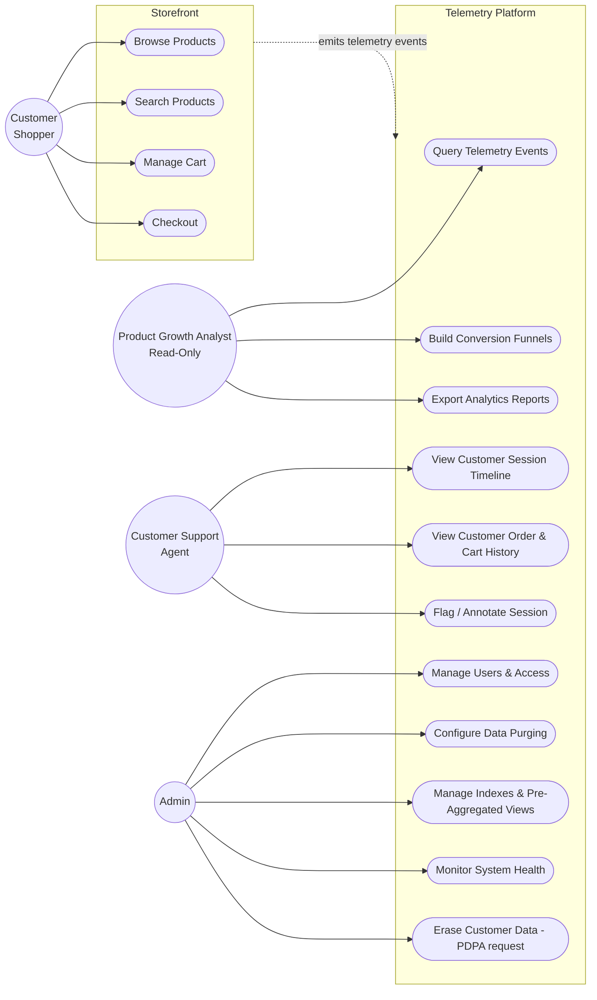

# Use Cases & Roles

**Project:** Phone & electronic accessories e-commerce store with a NoSQL-backed customer telemetry platform.

This document records the use case diagram approved by the lecturer, the actors (roles) in the system, and the proposed extensions to it. It is the starting point for the data model and the final report.

---

## 1. Approved use case diagram (baseline)

### Actors

| Actor | Description |
|---|---|
| **Product Growth Analyst** (read-only) | Explores customer behaviour data to improve conversion. Cannot modify data or system configuration. |
| **Admin** | Operates the platform: access control, data retention, performance and health. |

### Use cases

| # | Use case | Actor | Business goal |
|---|---|---|---|
| UC1 | Query Telemetry Events | Analyst | View real-time customer activity and website navigation paths. |
| UC2 | Build Conversion Funnels | Analyst | Identify exactly where customers abandon their shopping carts. |
| UC3 | Export Analytics Reports | Analyst | Share website performance insights with the marketing team. |
| UC4 | Manage Users & Access | Admin | Ensure only authorised staff can view sensitive business data. |
| UC5 | Configure Data Purging | Admin | Automatically clean up old records and configure TTL to save storage costs. |
| UC6 | Optimize System Speed | Admin | Ensure the analytics dashboards load instantly for the team. |
| UC7 | Monitor System Health | Admin | Monitor the health of the database and backend. |

---

## 2. Extensions (approved)

### 2.1 New actor: Customer (Shopper), the telemetry source

The baseline diagram only contains actors that *consume* telemetry. Nothing *produces* it. The Customer is the actor whose storefront actions generate every event the analyst later queries, so they belong on the diagram.

| # | Use case | Events emitted (examples) |
|---|---|---|
| UC8 | Browse Products | `page_view`, `product_view`, `category_view` |
| UC9 | Search Products | `search` (query text, filters, result count) |
| UC10 | Manage Cart | `add_to_cart`, `remove_from_cart`, `update_quantity` |
| UC11 | Checkout | `checkout_started`, `payment_submitted`, `order_placed`, `checkout_failed` |

**Why it matters for the report:** the ingestion side is where NoSQL is strongest. It handles high write throughput, append-only events and flexible event payloads, since each event type carries different fields.

### 2.2 New actor: Customer Support Agent

Handles customer complaints ("my checkout failed", "I was charged twice") by looking up exactly what that customer did.

| # | Use case | Business goal |
|---|---|---|
| UC12 | View Customer Session Timeline | See the ordered sequence of a single customer's events leading up to a complaint. |
| UC13 | View Customer Order & Cart History | Check what the customer ordered or abandoned. |
| UC14 | Flag / Annotate Session | Mark a session for escalation to engineering or the analyst. |

**Why this role:**

- **A different access pattern.** The analyst runs *wide aggregate scans* across all users (funnels, trends). Support runs *narrow point lookups* on one customer or one session. The data model has to serve both, which demonstrates query-driven schema design (partition keys, compound indexes), a core NoSQL modelling principle.
- **It makes access control concrete.** Support should see *masked* PII (e.g. `j***@gmail.com`, no full address). This gives UC4 (Manage Users & Access) a real role-based access control scenario.

*Alternative considered:* Marketing Manager (campaign attribution, A/B test results). Rejected because it overlaps heavily with the Product Growth Analyst.

### 2.3 Changes to existing Admin use cases

| Change | Detail |
|---|---|
| **Rename UC6** "Optimize System Speed" → **"Manage Indexes & Pre-Aggregated Views"** | The original name is vague. The new name states what the admin actually does and can be demonstrated (index creation, `explain()` plans, materialised rollup collections). |
| **Add UC15: Erase Customer Data (right-to-erasure request)** | Right to erasure for a single customer (approved as a "GDPR request"; reframed under Sri Lanka's PDPA, see §2.4). Removing one user's data from denormalised, duplicated records is harder in NoSQL than in a normalised relational schema, which feeds the report's *limitations* section. |
| Cosmetic | The "Monitor System Health" note uses a different font from the other notes. Make it match. |

### 2.4 Legal context: Sri Lanka's PDPA, not GDPR

UC15 was approved as a "GDPR request". Cellora sells only in Sri Lanka (LKR prices, local delivery), so the law that applies is Sri Lanka's **Personal Data Protection Act, No. 9 of 2022 (PDPA)**. The EU's GDPR reaches non-EU businesses only when they offer goods or services to people in the EU or monitor their behaviour there (GDPR Art. 3(2)); Cellora does neither. The PDPA was modelled closely on GDPR, so the concepts map directly: lawful processing, data minimisation, retention limits, security, and data subject rights, including **erasure (PDPA s.16)**. If Cellora ever sold to EU customers, GDPR would apply as well, and the same erasure mechanism would serve both.

**Commencement status (checked 28 Sep 2026):**

| When | What |
|---|---|
| March 2022 | PDPA No. 9 of 2022 enacted |
| 2023 | Only the parts setting up the regulator (the Data Protection Authority) and administrative/interpretation provisions brought into operation by Gazette orders |
| 31 Oct 2025 | PDPA (Amendment) Act No. 22 of 2025 published: removed the fixed commencement timelines; remaining parts start on dates the Minister appoints by Gazette order |
| 22 Jul 2026 | Gazette Extraordinary No. 2498/16: **Part I (processing of personal data) and Part III (controllers and processors) operational from 1 January 2027** |
| Not yet appointed | **Part II (rights of data subjects: access, correction, erasure, withdrawal of consent, objection) and Part VII (penalties)** |

**What that means for Cellora:** the processing obligations bind it from 1 Jan 2027, but the enforceable right to erasure (Part II) has no start date yet. UC15 therefore implements the right **ahead of commencement**, as readiness and privacy by design. The same design also serves the Part I obligations: retention limits (UC5, the events TTL), data minimisation (PII masking for Support), and accountability (`audit_log`). Keeping orders after erasure (pseudonymised) rests on the legal duty to keep financial records.

*Sources: Data Protection Authority of Sri Lanka (dpa.gov.lk); Parliament of Sri Lanka, Acts No. 9 of 2022 and No. 22 of 2025; law-firm and industry summaries of Gazette No. 2498/16. Re-check dpa.gov.lk before submission, since further commencement orders are expected.*

---

## 3. Updated use case diagram

---

## 4. Use case → NoSQL feature mapping

Each use case should show a specific NoSQL characteristic. This mapping feeds the *characteristics / applications / strengths / limitations* sections of the report.

| Use case | NoSQL feature demonstrated | Report angle |
|---|---|---|
| UC8–UC11 (event ingestion) | High-throughput writes, schema-flexible event documents | Strength: horizontal write scaling, no migrations for new event types |
| Product catalog (UC8/UC9) | Document model: phones, cases and chargers have very different attributes | Strength: avoids sparse columns / EAV tables required in SQL |
| UC1 Query Telemetry Events | Time-series collection / time-bucketed partitions, range queries | Characteristic: data modelled around access patterns |
| UC2 Build Conversion Funnels | Aggregation pipeline | Limitation: no ad-hoc JOINs; funnels must be computed in-pipeline |
| UC3 Export Analytics Reports | Aggregation + export (CSV/JSON) | Application: analytics workloads |
| UC4 Manage Users & Access | Database roles / RBAC, field-level masking | Characteristic: security model differs from SQL GRANTs |
| UC5 Configure Data Purging | TTL indexes / TTL on writes | Strength: built-in automatic expiry |
| UC6 Manage Indexes & Views | Compound indexes, `explain()`, pre-aggregated rollup collections | Trade-off: denormalisation speeds reads, costs storage and write complexity |
| UC7 Monitor System Health | Server status / replica set status / metrics | Characteristic: distributed architecture, replication |
| UC12 Session Timeline | Point lookup by `customerId` / `sessionId` (partition key design) | Characteristic: query-driven modelling |
| UC13 Order & Cart History | Embedded vs referenced documents; key-value cart store | Trade-off: embedding vs referencing |
| UC14 Flag / Annotate Session | Partial document updates | Strength: atomic single-document updates |
| UC15 Erase Customer Data | Deleting data scattered across denormalised collections | Limitation: weaker cross-document consistency, harder erasure |

---

## 5. Technology options

Showing more than one NoSQL family maps directly onto the learning outcome ("the family of database technologies usually referred to as NoSQL").

| Option | Stores | Pros | Cons |
|---|---|---|---|
| **A: Polyglot** | Document store (MongoDB) for catalog and orders; time-series or wide-column (MongoDB time-series collections or Cassandra) for telemetry; key-value (Redis) for carts, sessions and live counters | Demonstrates 2–3 NoSQL families and the reasoning behind choosing each, which gives strong report and viva material | More moving parts to build and run |
| **B: MongoDB only** | Regular collections for catalog and orders; time-series collection for telemetry | Simpler to build and deploy; still shows document and time-series modelling | Covers fewer NoSQL families |

**Decision:** *TBD*. Option B is the safer baseline. Option A is worth it if time allows (e.g. add Redis for carts and live counters as a stretch goal).

---

## 6. Open items

- [x] Confirm extended use case diagram with lecturer
- [x] Application stack: Node.js backend, React frontend, MongoDB (required)
- [ ] Decide which additional NoSQL stores (if any) are justified
- [ ] Design data model (collections, keys, indexes) per use case
- [ ] Redraw final diagram in the same style as the approved version
